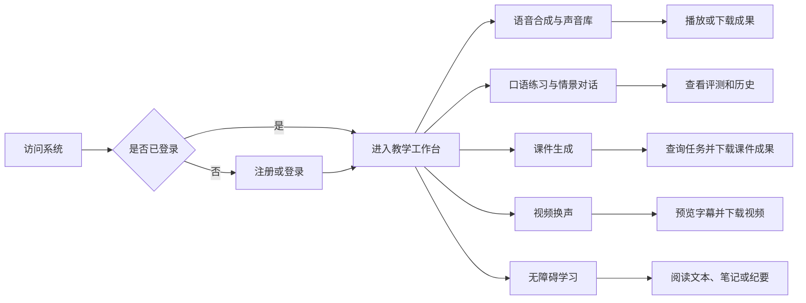
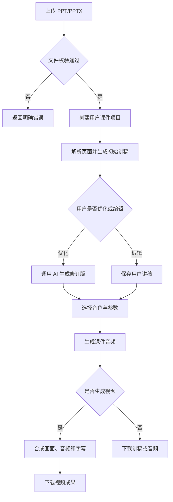
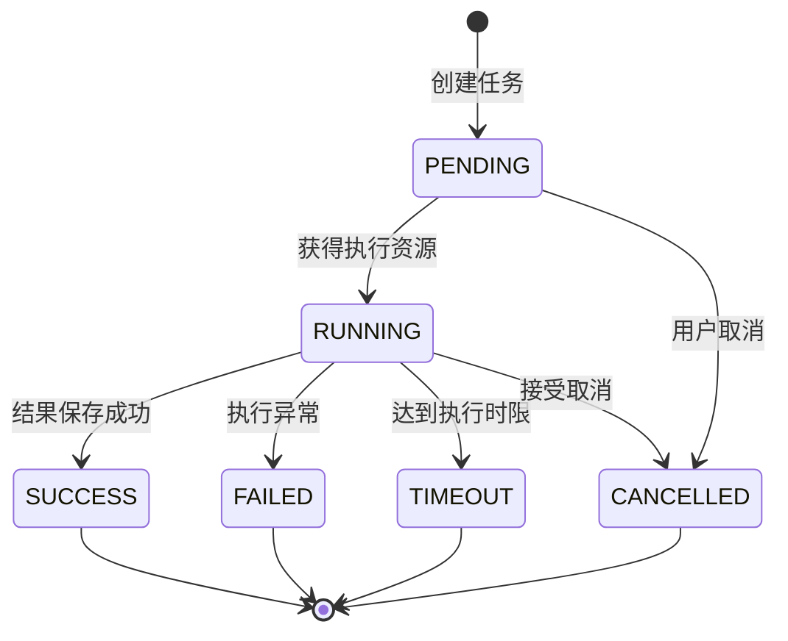
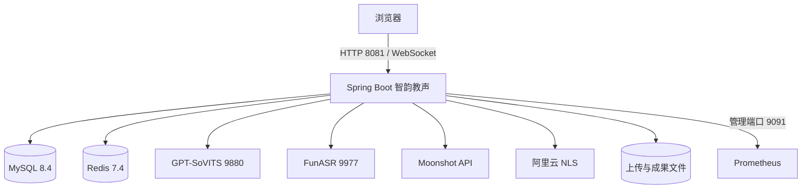

# 03-智韵教声-需求说明书

## 第一部分 引言

### 一、编写说明

本文用于明确“智韵教声”教学语音与课件处理系统的建设背景、目标用户、功能范围、质量要求和验收标准，为系统设计、开发、测试、演示和部署提供统一依据。

本文以当前仓库中的 README、运行配置、数据库迁移、控制器、服务和测试为事实基础。文中“应”表示需要满足的产品要求，“当前实现”表示代码中已经存在的能力，“规划项”表示后续可扩展但不属于本期验收范围的能力。

### 二、项目定义

#### 1. 智韵教声

智韵教声是一套面向教师、学生及其他内容创作者的教学语音与数字课件处理系统。系统围绕“文本、声音、课件、视频、练习记录”构建统一工作流，提供语音合成、语音识别、声音复刻、方言合成、口语评测、情景对话、课件讲稿生成、音视频生成及学习辅助等能力。

#### 2. TTS

TTS（Text to Speech）指将文本转换为可播放语音。系统支持普通语音合成、流式合成、方言合成以及基于参考音频的声音复刻合成。

#### 3. ASR

ASR（Automatic Speech Recognition）指将用户上传或实时采集的语音转换为文本。系统通过 HTTP 接口处理文件转写，并通过 WebSocket 提供流式识别通道。

#### 4. 声音复刻

声音复刻指基于参考音频生成可用于后续语音合成的音色。当前系统可对接本地 GPT-SoVITS 服务，也可对接阿里云 NLS 声音复刻能力。

#### 5. 课件项目

课件项目是以 PPT/PPTX 等演示文稿为输入，围绕讲稿提取、AI 优化、语音生成、虚拟形象视频生成、版本记录和成果下载组织的用户级工作单元。

#### 6. 免数据库模式

免数据库模式（`nodb`）用于本地演示和基础功能验证。账号与部分业务状态保存在内存中，进程重启后不保证保留，不得将其作为生产数据持久化方案。

### 三、读者对象

本文主要面向项目负责人、产品设计人员、开发人员、测试人员、部署运维人员、教师用户和演示验收人员。

### 四、参考资料

- `README.md`
- `RUN.md`
- `pom.xml`
- `src/main/resources/application.yml`
- `src/main/resources/application-nodb.yml`
- `src/main/resources/db/migration/V1__init_schema.sql` 至 `V4__pending_file_cleanup.sql`

## 第二部分 项目综述

### 一、项目背景

教师制作教学音频和数字课件时，通常需要在录音、剪辑、语音合成、字幕处理、PPT 内容整理和视频生成等多个工具之间切换。传统流程重复劳动多，对录音环境、发音能力和媒体处理技术要求较高；学生开展口语练习时，也常缺少可重复、可量化并能保留历史记录的反馈机制。

智韵教声将语音、课件和练习相关能力集中到统一的 Web 应用中，通过外部语音服务和大语言模型降低内容制作门槛，同时通过用户隔离、任务状态、文件校验和持久化记录保证业务过程可管理、结果可追踪。

### 二、建设目标

1. 为用户提供统一的注册、登录和教学语音工作台。
2. 支持文本转语音、流式播放、方言语音和自定义音色使用。
3. 支持文件语音识别和实时流式语音识别。
4. 支持口语评测、历史记录和多轮情景练习。
5. 支持 PPT 内容读取、讲稿生成与优化、课件音频和视频生成。
6. 支持视频字幕预览、字幕修订和视频换声处理。
7. 支持文本朗读、PPT 朗读、语音笔记和学习纪要等无障碍学习能力。
8. 对耗时任务提供进度查询、取消、失败提示和成果下载能力。
9. 提供免数据库演示模式与 MySQL 持久化模式，便于教学演示和正式数据管理。

### 三、建设原则

#### 1. 教学实用性

功能应直接服务于备课、授课、口语训练和学习整理，不引入与教学语音无关的复杂业务。

#### 2. 人机协同

AI 生成的讲稿、纪要和评测反馈用于辅助用户，不应掩盖识别失败、模型不可用或结果不确定等情况。用户应能查看、修改或重新生成关键内容。

#### 3. 数据与文件安全

用户只能访问自己的私有声音、课件项目、异步任务、语音笔记和练习历史。上传文件必须经过类型、大小、内容特征和存储路径校验。

#### 4. 状态可见

耗时处理应展示等待、运行、完成、失败或取消状态；外部服务不可用时应给出明确错误，不得以随机结果或静态演示数据冒充成功结果。

#### 5. 渐进部署

系统应允许使用 `nodb` 模式完成基础演示，也应允许在 MySQL、Redis 和外部语音服务可用时启用完整能力。不同模式的能力差异必须明确标注。

## 第三部分 用户与业务需求

### 一、用户角色

| 角色 | 主要目标 | 数据权限 |
| --- | --- | --- |
| 未登录访问者 | 打开登录页，完成注册或登录 | 仅访问公开静态资源和认证接口 |
| 普通用户 | 合成语音、管理声音、练习口语、生成课件和处理视频 | 仅访问本人产生或被授权公开的数据 |
| 管理属性用户 | 保留现有 `permission` 标记所表达的扩展空间 | 当前版本未形成独立后台管理业务，不作为本期验收角色 |
| 外部服务 | 提供 TTS、ASR、Moonshot 或阿里云 NLS 能力 | 仅通过服务端配置和受控接口调用，不直接访问业务数据库 |

### 二、总体业务流程

### 三、功能需求

#### 1. 用户注册与登录

1. 系统应支持用户名和密码注册。
2. 用户名和密码不能为空，用户名必须唯一。
3. 密码应满足系统配置的长度和基本复杂度要求，并以安全散列形式保存。
4. 登录成功后，系统应签发带有效期的 JWT，并返回用户名。
5. 除公开页面、静态资源、注册、登录和健康检查外，业务接口应校验登录凭证。
6. 系统应按“来源 IP + 用户名”记录失败尝试，达到阈值后临时限制登录。
7. 对不存在的用户和错误密码应返回一致的失败信息，避免泄露账号存在性。
8. `nodb` 模式应提供明确标注的演示账号，并说明内存数据重启后丢失。

#### 2. 声音库管理

1. 用户应能查看可用的公开音色和本人私有音色。
2. 用户应能按条件搜索音色。
3. 用户应能上传参考音频并创建私有音色记录。
4. 用户应能修改本人音色的名称和适用场景。
5. 用户应能删除本人音色，删除操作不得影响其他用户文件或上传目录之外的文件。
6. 用户应能试听有权访问的音色音频。
7. 服务端应生成并保存相对存储键，不得信任客户端提供的任意本地文件路径。
8. 上传应限制音频格式、MIME、文件特征、大小和时长，并执行用户容量配额。

#### 3. 文本语音合成

1. 用户应能输入合成文本并选择音色、语言、语速等受支持参数。
2. 系统应支持普通 WAV 响应和流式 WAV 响应。
3. 系统应校验文本、语言及参考音色的可用性。
4. 系统应在外部 TTS 服务失败时返回明确错误，不得返回伪造音频。
5. 前端应防止一次播放过程中重复或并发触发多个音色预览。
6. 合成结果应可在浏览器播放；需要保存时，应提供下载能力。

#### 4. 方言语音合成

1. 系统应展示真实可用的阿里云方言音色清单。
2. 用户应能选择方言音色并提交文本进行合成。
3. 系统应支持普通响应和流式 MP3 播放。
4. 阿里云凭据未配置或服务调用失败时，应返回可识别的不可用状态。
5. NLS Token 应支持基于 RAM AccessKey 自动获取、缓存和到期前刷新，不要求用户长期维护手工 Token。

#### 5. 语音识别

1. 用户应能上传受支持的音频文件并获取转写文本。
2. 系统应通过 `/asr/transcribe` 提供文件识别能力。
3. 系统应通过 `/ws/asr/stream` 接收实时 PCM 音频并推送识别事件。
4. WebSocket 建连和消息处理应校验 JWT，来源域应受 CORS/Origin 配置约束。
5. FunASR 服务不可用、音频不合法或处理超时时，应中止识别并给出明确失败原因。

#### 6. 口语评测与情景对话

1. 系统应提供示例文本和示例音频。
2. 用户应能上传录音并提交参考文本、练习模式、会话编号和语言。
3. 系统应基于真实 ASR 结果计算流利度、发音、准确度、正确率、错误项和反馈。
4. ASR 失败时不得生成随机分数或保存虚假评测记录。
5. 数据库模式应按用户保存评测历史，并支持按会话查询。
6. 系统应提供可选情景列表，支持启动和继续多轮情景练习。
7. 多轮会话启用 Redis 时保存于 Redis，并设置过期时间；Redis 未启用时可退化为进程内会话。

#### 7. 课件与讲稿生成

1. 用户应能上传 PPT/PPTX 文件创建课件项目。
2. 系统应解析演示文稿内容并生成或整理初始讲稿。
3. 用户应能提交优化指令，生成新的讲稿修订版本。
4. 用户应能直接修改当前讲稿。
5. 用户应能选择音色、语速、音调和节奏生成课件音频。
6. 用户应能上传虚拟形象素材，并生成课件视频。
7. 系统应保存项目所有者、状态、输入文件、讲稿、修订号、媒体参数、成果路径和错误信息。
8. 用户只能查询、修改和下载自己的课件项目。
9. 系统应提供同步接口和异步任务接口；前端对耗时操作应优先采用异步任务并显示进度。
10. Moonshot 等 AI 服务不可用时，应显示失败或使用代码中明确提供的本地降级结果，不得将降级文本标记为云端 AI 成功。

#### 8. 视频字幕预览与换声

1. 用户应能上传视频，并获取自动识别的字幕预览。
2. 字幕预览应返回可编辑的时间段和文本内容。
3. 用户应能修订字幕后提交视频换声处理。
4. 系统应根据视频时长、字幕时间轴和合成音频时长处理媒体同步。
5. 输出视频应保持可播放的视频轨和替换后的音频轨，必要时支持字幕烧录或保留无烧录模式。
6. FFmpeg/ffprobe 不可用、输入视频无效、ASR/TTS 失败或处理超时时，应停止任务并返回明确错误。
7. 临时上传和中间文件应在成功、失败或取消后按规则清理。

#### 9. 声音复刻

1. 用户应能上传本地参考音频，通过 GPT-SoVITS 完成一次性声音复刻合成。
2. 系统应支持查询本地与阿里云声音复刻能力状态。
3. 阿里云复刻应要求公网可访问的 HTTPS 音频地址和合法音色前缀。
4. 用户应能使用阿里云返回的 `VoiceName` 生成音频。
5. 本地参考音频处理完成后应删除临时文件；删除失败应记录并进入待清理机制。

#### 10. 无障碍学习辅助

1. 用户应能上传文本文件，读取其内容用于后续朗读。
2. 用户应能上传 PPT/PPTX 并提取可朗读文本。
3. 用户应能上传语音并生成文字笔记，语音笔记按用户隔离保存和查询。
4. 用户应能输入学习材料并生成学习纪要。
5. 外部 AI 不可用时，纪要结果应标明本地处理或失败状态。

#### 11. 异步任务管理

1. 系统应为课件优化、音频生成、视频生成等耗时操作创建唯一任务编号。
2. 任务状态至少应包括等待（`PENDING`）、运行（`RUNNING`）、成功（`SUCCESS`）、失败（`FAILED`）、取消（`CANCELLED`）和超时（`TIMEOUT`）。
3. 任务应记录所有者、类型、进度、结果、错误、去重键和时间信息。
4. 用户只能查询或取消自己的任务。
5. 系统应限制线程池、队列容量、单用户并发数和单任务超时时间。
6. 重复提交可通过去重键复用有效任务，避免同一操作被反复执行。

#### 12. 运行监控

1. 系统应提供存活与就绪健康检查。
2. 就绪检查应区分数据库、Redis、GPT-SoVITS 和 FunASR 的状态。
3. 生产验收模式可要求外部语音服务必须可用；本地开发模式可将其设为非阻断依赖。
4. 系统应输出 Prometheus 指标，并为 HTTP 请求配置延迟分位与 SLO 桶。
5. 管理端口应与业务端口分离，并仅绑定或暴露给可信网络。

### 四、业务规则

1. 私有资源按 JWT 对应用户名隔离，客户端传入的用户名不能覆盖服务端认证身份。
2. 文件必须保存在配置的业务根目录内，所有读取、下载和删除路径必须经过目录边界校验。
3. 上传文件的扩展名、MIME 和文件头必须相互匹配。
4. 业务成果先完成服务端处理并保存状态，再向前端报告成功。
5. 外部服务失败不得被转换为随机评分、静态统计或伪造音频。
6. 数据库模式以 MySQL 为持久化事实来源；`nodb` 内存数据仅用于演示。
7. Redis 用于缓存和短期会话，不代替 MySQL 持久化业务记录。

## 第四部分 用例分析

### 一、主要用例

| 用例 | 前置条件 | 主流程 | 成功结果 | 主要异常 |
| --- | --- | --- | --- | --- |
| 注册登录 | 用户未登录 | 注册账号→输入凭据→登录 | 获得有效 JWT | 用户名重复、密码不合规、登录限流 |
| 合成语音 | 已登录且 TTS 可用 | 输入文本→选择音色→提交→播放 | 返回可播放音频 | 参数错误、音色无权访问、外部服务失败 |
| 口语评测 | 已登录且 ASR 可用 | 录音→提交参考文本→识别→评分 | 返回真实评测并保存历史 | 音频非法、ASR 失败、不保存虚假记录 |
| 创建课件 | 已登录 | 上传 PPT→生成讲稿→优化→生成音频/视频 | 保存项目和成果 | 文件非法、AI/TTS/FFmpeg 失败、任务超时 |
| 视频换声 | 已登录且媒体工具可用 | 上传视频→预览字幕→修订→处理 | 返回可播放视频 | 无音轨、识别失败、合成失败、超时 |
| 语音笔记 | 已登录且 ASR 可用 | 上传音频→识别→保存笔记 | 在本人列表中可见 | 识别失败、越权访问 |
| 查询任务 | 已登录且任务存在 | 按编号查询或按用户列表查询 | 返回当前进度和结果 | 任务不存在、非所有者访问 |

### 二、课件生成活动流程

### 三、异步任务状态

## 第五部分 非功能需求

### 一、安全性

1. 生产环境必须通过环境变量或被忽略的本地配置提供 JWT、数据库和第三方密钥。
2. JWT Secret 应使用足够长度的随机值，过期时间应可配置。
3. 密码不得明文保存，日志不得输出密码、Token、AccessKey 或用户完整私有路径。
4. 登录接口应具备失败次数限制。
5. CORS 必须使用明确来源列表，不允许生产环境使用任意来源。
6. 文件访问必须防止路径穿越、伪造类型和跨用户读取。

### 二、可靠性

1. 外部服务调用应设置连接、读取和媒体处理超时。
2. 异步线程池和队列必须有界，达到容量限制时应拒绝新任务并提示用户。
3. 数据库结构由 Flyway 管理，启动时执行版本校验。
4. 数据库写入成功但文件删除失败时，应记录 `pending_file_cleanup` 并重试。
5. 系统重启后，数据库模式下的课件项目、修订版本、任务和评测历史应可重新加载。

### 三、易用性与兼容性

1. 系统采用 B/S 访问方式，支持当前主流 Chrome 和 Edge 浏览器。
2. 页面应清楚展示处理状态、错误原因和可执行下一步。
3. 音频应能直接试听，生成成果应能下载。
4. 长内容面板应可滚动，不能因固定布局导致按钮或结果不可达。
5. 当前仓库只包含已构建前端产物；前端样式或交互的重大改版需先恢复原始前端源码与锁文件。

### 四、性能与容量

以下指标是本项目的验收目标，不代表已经取得的生产基准结果：

| 级别 | 指标 | 验收方式 |
| --- | --- | --- |
| A | 登录、列表、任务查询等非媒体接口在受控环境下成功率不低于 99% | 使用专用测试账号执行基础负载冒烟 |
| A | 单个异步任务不得无限执行，默认超时上限 15 分钟 | 构造超时任务并检查终态 |
| A | 单用户并发耗时任务默认不超过 2 个 | 并发提交并检查拒绝或排队行为 |
| A | 上传大小遵循音频 20MB、图片 10MB、演示文稿 30MB、视频 50MB、文本 2MB 的默认限制 | 边界值与超限测试 |
| B | 常规非媒体接口应优先满足 p95 不高于 1 秒 | 在明确硬件、数据规模和并发下测试 |
| B | 轻量稳定性验证错误率目标不高于 0.5% | 使用 `production_gate.py stability` 生成报告 |
| C | 具体 TTS、ASR、课件和视频耗时 | 按外部模型、输入长度和硬件单独记录，不设虚假统一秒级指标 |

### 五、可维护性

1. Java 代码应保持 Controller、Service、Repository/Mapper、配置与领域对象职责清晰。
2. 配置项应集中在 Spring 配置和环境变量中，不将机器绝对路径写入业务逻辑。
3. 新增数据库结构必须通过新的 Flyway 迁移文件完成。
4. 新增接口应同步补充自动化测试和本文档。

## 第六部分 验收标准

### 一、功能验收

| 编号 | 验收项 | 通过标准 |
| --- | --- | --- |
| F-01 | 注册与登录 | 合法用户可获得 JWT；非法输入、错误密码和频繁失败均被正确处理 |
| F-02 | 声音库 | 私有音色隔离，上传、搜索、修改、删除和试听形成闭环 |
| F-03 | TTS/方言 | 配置真实服务后输出可播放音频；服务失败时不返回伪成功 |
| F-04 | ASR | 文件识别和 WebSocket 流式识别能返回真实文本与终态事件 |
| F-05 | 口语练习 | 真实识别成功后返回分项评分并保存历史；识别失败不造分 |
| F-06 | 课件项目 | 上传、讲稿、修订、音频、视频、状态和下载链路可完成 |
| F-07 | 视频换声 | 字幕预览可编辑，输出视频含有效画面与目标音频 |
| F-08 | 学习辅助 | 文本/PPT 读取、语音笔记和学习纪要按约定返回结果 |
| F-09 | 异步任务 | 可查询进度、终态、结果和错误，可取消本人任务 |
| F-10 | 数据隔离 | 用户不能访问其他用户的声音、项目、任务、笔记和历史 |

### 二、工程验收

1. `mvn test` 全量测试通过；需要真实凭据的测试可明确跳过，但不得计为已验证。
2. `mvn -DskipTests package` 成功生成可运行包。
3. `nodb` 模式能够通过 `./launch.ps1 -Mode nodb` 启动并访问 `http://localhost:8081`。
4. 数据库模式能从空 MySQL 库执行 Flyway 迁移，并在二次启动时保持结构一致。
5. Docker Compose 配置能够解析；只有在真实 Docker 引擎完成构建、启动和健康检查后，才能判定容器验收通过。
6. 外部 TTS、ASR、Moonshot 和阿里云能力只有在真实服务/凭据调用成功后，才能判定对应集成通过。
7. 浏览器端核心流程必须通过实际点击、播放和下载验证，接口测试不能替代全部界面验收。

### 三、本期范围边界

以下能力不属于当前仓库已实现范围，不应仅因参考文档出现而写入本期通过项：

- 电商订单、售后工单、客服工作台和用户评价分析；
- Kafka、Elasticsearch、向量数据库或 RAG 知识库；
- 完整的独立 Vue/Vite 前端源码构建；
- 多租户组织、班级、课程和角色权限后台；
- 已完成的公网生产部署、容量基准或灾备演练。

## 第七部分 环境与部署要求

### 一、本地开发环境

- 操作系统：Windows 10/11 或具备等价 Java、Maven、FFmpeg 环境的系统；
- JDK：17；
- Maven：3.9 及以上；
- 浏览器：Chrome 或 Edge 当前稳定版；
- Python ASR：推荐 Python 3.12，并准备 FunASR 模型文件；
- 可选外部服务：GPT-SoVITS、Moonshot、阿里云 NLS。

### 二、数据与中间件

- MySQL：Docker Compose 当前使用 MySQL 8.4；
- Redis：Docker Compose 当前使用 Redis 7.4-alpine；
- 数据库字符集：`utf8mb4`，排序规则 `utf8mb4_unicode_ci`；
- 文件存储：当前使用服务器本地目录或 Docker 持久卷；
- 数据库迁移：Flyway。

### 三、应用部署

业务端口默认使用 `8081`。Docker 环境下管理端口使用 `9091`，Prometheus 默认只绑定宿主机 `127.0.0.1:9090`。生产环境应在应用前配置 HTTPS 反向代理，并限制管理端点的访问来源。
