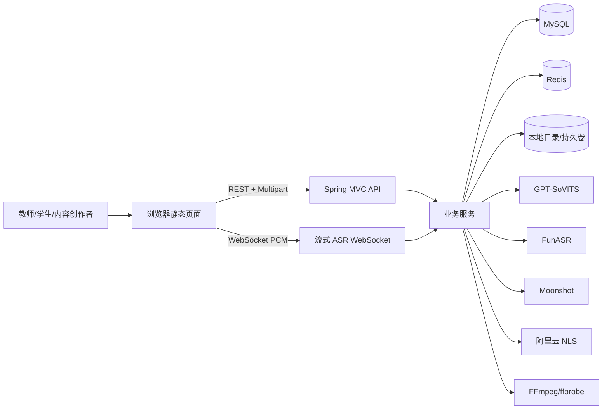
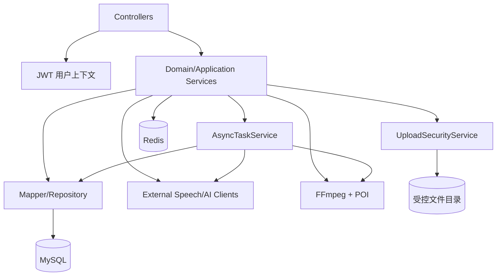
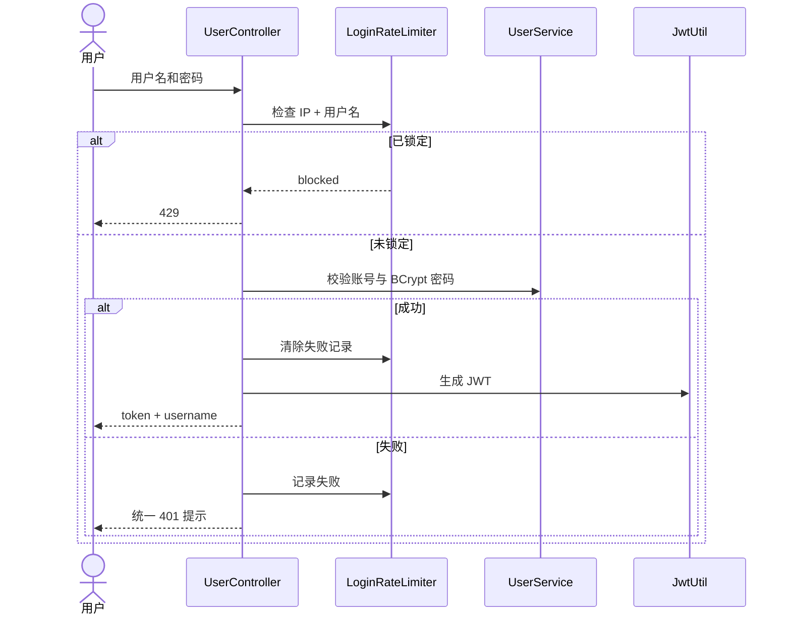
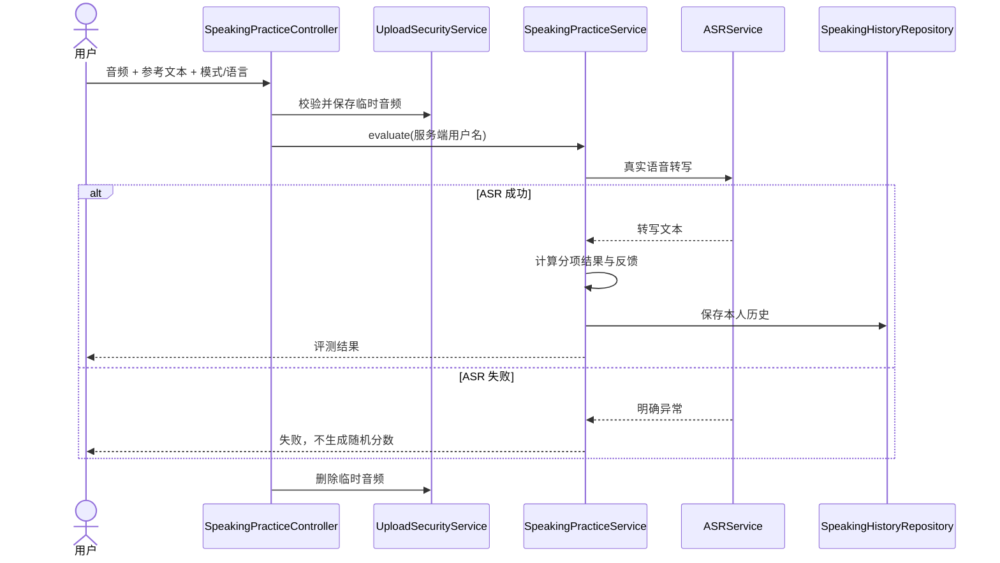
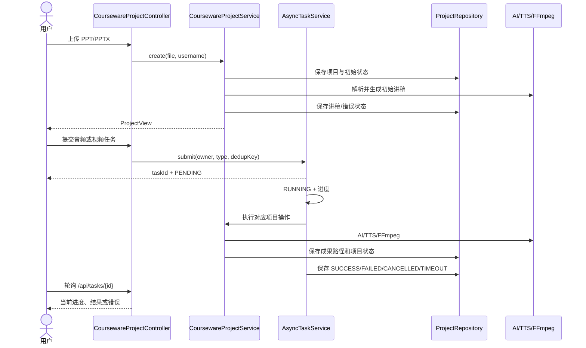
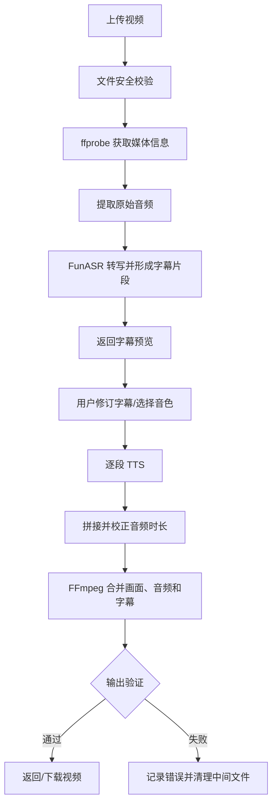
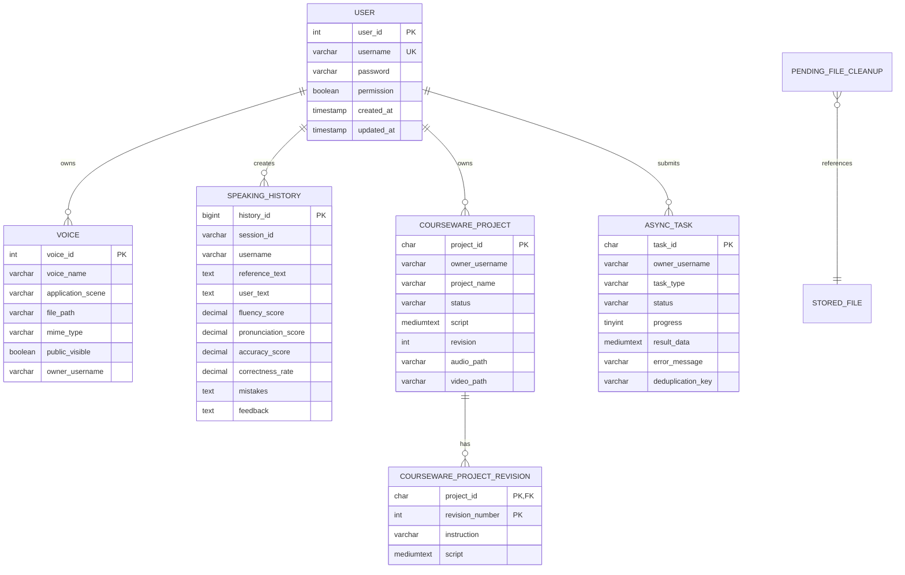
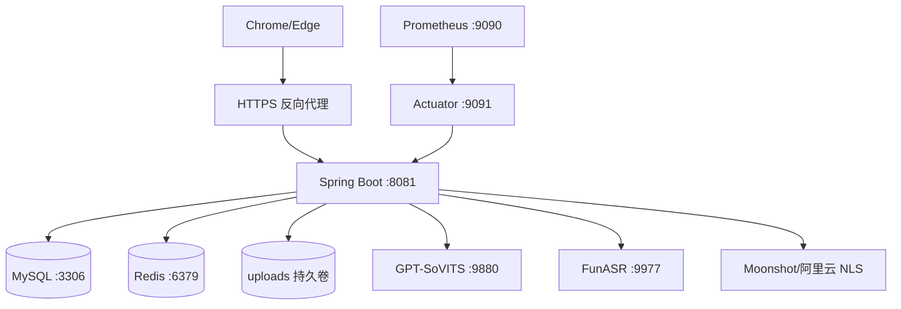

# 04-智韵教声-概要设计文档

## 第一部分 引言

### 一、编写目的

本文将《03-智韵教声-需求说明书》中的业务需求转化为系统边界、模块职责、数据结构、接口、流程、安全和部署设计，为开发、测试、维护和验收提供概要级技术依据。

本文描述当前 `fctts-main5` 仓库所采用的真实架构。

### 二、读者对象

项目负责人、系统设计人员、Java/Python 开发人员、前端维护人员、测试人员、部署运维人员以及需要理解系统结构的答辩或演示人员。

### 三、术语与缩写

| 缩写/术语 | 说明 |
| --- | --- |
| FCTTS | 本项目仓库及教学语音系统的工程简称 |
| TTS | 文本转语音 |
| ASR | 自动语音识别 |
| NLS | 阿里云智能语音交互服务 |
| GPT-SoVITS | 当前可接入的本地声音克隆与合成服务 |
| FunASR | 当前可接入的本地语音识别服务 |
| JWT | 业务接口身份凭证 |
| Flyway | 数据库版本迁移工具 |
| 课件项目 | 从 PPT 输入到讲稿、音频和视频成果的用户级聚合 |
| 异步任务 | 课件优化、音频或视频等耗时操作的可查询执行单元 |

### 四、参考资料

- 《03-智韵教声-需求说明书》
- `README.md`、`RUN.md`
- `pom.xml`
- `src/main/resources/application.yml`
- `src/main/resources/db/migration/`
- `docker-compose.yml`
- `src/main/java/com/a09/tts/` 下的控制器、服务、仓储、配置和安全组件

## 第二部分 项目概述

### 一、项目描述

智韵教声是一个基于 Spring Boot 的 B/S 教学语音与课件处理应用。系统使用统一 Web 入口承载用户登录、声音管理、文本转语音、语音识别、口语练习、课件生成、视频换声和无障碍学习功能。

系统本身负责用户身份、业务编排、数据持久化、文件安全、任务状态和统一错误处理；GPT-SoVITS、FunASR、Moonshot 和阿里云 NLS 作为外部能力提供者。MySQL 保存长期业务数据，Redis 保存可丢弃的缓存与短期会话，本地文件目录或 Docker 卷保存上传文件和媒体成果。

### 二、设计目标

1. 将教学语音与课件处理能力封装为边界清晰的 HTTP/WebSocket 接口。
2. 以服务端认证身份和资源所有者字段实现用户数据隔离。
3. 通过受控上传目录、文件类型检查和相对存储键保证文件安全。
4. 通过异步任务、超时和有界线程池管理耗时媒体工作流。
5. 通过数据库迁移、健康检查、指标和部署脚本提高可运行性。
6. 在外部 AI/语音服务不可用时提供真实、可诊断的失败或明确降级。

## 第三部分 设计约束

### 一、技术约束

1. 后端使用 Java 17、Spring Boot 3.4.1 和 Spring AI 1.0.3。
2. Web 接口同时使用 Spring MVC；外部流式调用场景可使用 WebFlux 客户端。
3. 数据访问采用 MyBatis，关系数据库采用 MySQL，结构版本由 Flyway 管理。
4. 身份凭证采用 Auth0 Java JWT，密码散列采用 Spring Security Crypto 的 BCrypt。
5. 实时语音识别采用 Spring WebSocket。
6. 媒体处理使用 FFmpeg/ffprobe，PPT/PPTX 读取使用 Apache POI。
7. 可选缓存和会话存储使用 Spring Data Redis。
8. 监控采用 Spring Boot Actuator、Micrometer 和 Prometheus。
9. 前端由 Spring Boot 直接提供 `src/main/resources/static` 中的已构建文件。

### 二、前端约束

当前仓库没有 `package.json`、锁文件、Vite/Vue 配置和组件源码，只有已构建 bundle 与少量独立补丁脚本。因此当前设计只把静态页面视为可部署产物，不将其描述为可复现构建的前端工程。重大页面重构必须先恢复原始源码。

### 三、部署约束

1. 默认业务端口为 `8081`。
2. 默认 Profile 为 `nodb`；数据库模式必须显式启用并提供数据源与 JWT 配置。
3. Docker Compose 运行 MySQL、Redis 和后端，可选启动 Prometheus。
4. GPT-SoVITS 和 FunASR 默认作为宿主机外部服务，不在当前 Compose 中构建。
5. 生产环境必须使用真实随机密钥，并限制 CORS、管理端点和上传目录权限。

## 第四部分 总体架构设计

### 一、系统上下文



### 二、逻辑分层

| 层次 | 主要组件 | 职责 |
| --- | --- | --- |
| 表示层 | `index.html`、`login.html`、已构建 JS/CSS、独立补丁脚本 | 页面展示、录音、播放、提交、状态轮询和错误提示 |
| 接口层 | Controller、WebSocket Handler、全局异常处理 | 接收请求、基础参数校验、身份上下文提取、响应封装 |
| 应用服务层 | TTS、ASR、声音、口语、课件、视频、无障碍、任务服务 | 编排业务流程和外部能力，维护状态与权限边界 |
| 数据访问层 | Mapper、Repository、Redis Store | MySQL 持久化、课件聚合保存、短期会话与缓存 |
| 基础设施层 | 上传安全、JWT、登录限流、FFmpeg、外部 API 客户端、监控 | 文件、认证、媒体、网络调用和可观测性 |

### 三、核心模块

#### 1. 认证与用户模块

- `UserController`/`UserNoDbController` 提供注册和登录。
- `UserService` 在数据库模式下维护用户；免数据库模式使用内存用户源。
- `JwtUtil` 生成和验证 JWT。
- `JwtAuthenticationInterceptor` 为受保护请求写入服务端可信的 `username`。
- `PasswordPolicy` 校验密码要求，`LoginRateLimiter` 控制失败尝试。

#### 2. 声音库模块

- `VoiceController` 与 `VoiceNoDbController` 分别服务数据库和免数据库模式。
- `VoiceService`/Mapper 管理声音元数据。
- `UploadSecurityService` 校验并保存参考音频。
- 访问控制由 `owner_username` 和 `public_visible` 共同决定。

#### 3. TTS 与方言模块

- `TTSController` 提供 WAV 普通合成和流式合成。
- `TTSServiceImpl` 校验文本、语言、音色并代理 GPT-SoVITS。
- `DialectTTSController` 与 `AliyunSpeechService` 提供音色目录、普通合成和流式 MP3。
- `AliyunNlsCredentials` 负责 NLS Token 获取、缓存和刷新。

#### 4. ASR 模块

- `ASRController` 接收音频文件并调用 ASR 服务。
- `StreamingAsrWebSocketHandler` 管理实时流式识别会话。
- `StreamingAsrSessionFactory` 抽象流式会话，阿里云实现负责上行 PCM 与下行事件映射。
- Python `scripts/asr_server.py` 可作为 FunASR HTTP 服务。

#### 5. 口语练习模块

- `SpeakingPracticeController` 提供示例、评测、历史和多轮情景接口。
- `SpeakingPracticeServiceImpl` 组合 ASR 文本、参考文本和评分逻辑。
- `DialogueSessionStore` 有 Redis 与内存实现，保存短期情景会话。
- 数据库模式将评测结果保存到 `speaking_history`。

#### 6. 课件模块

- `PPTController` 提供课件摘要入口。
- `CoursewareProjectController` 提供项目创建、读取、列表、优化、编辑、音频/头像/视频生成和成果下载。
- `CoursewareProjectService` 维护项目状态、讲稿修订、成果路径和用户所有权。
- `CoursewareProjectRepository` 由 JDBC 实现或免数据库实现支撑。
- `PPTServiceImpl` 使用 POI 读取课件，并通过共享 Moonshot 客户端生成内容。

#### 7. 视频换声模块

- `VideoVoiceSwapController` 提供处理与字幕预览接口。
- `VideoVoiceSwapServiceImpl` 组合 ASR、TTS、SRT 和 FFmpeg 命令。
- `MediaCommandRunner` 负责带超时执行媒体命令。
- 中间文件位于受控上传目录，流程结束后清理。

#### 8. 声音复刻模块

- `SoundCloneController` 暴露能力查询、本地上传复刻、阿里云复刻和复刻音色合成。
- `SoundCloneServiceImpl` 代理 GPT-SoVITS。
- 阿里云路径使用 HTTPS 音频地址和合法前缀创建 VoiceName。

#### 9. 无障碍学习模块

- `AccessibilityController` 提供文本读取、PPT 读取、语音笔记和学习纪要。
- `AccessibilityServiceImpl` 负责文件解析、ASR、Moonshot 摘要和用户级笔记文件。

#### 10. 异步任务与清理模块

- `AsyncTaskService` 提供任务提交、去重、并发限制、进度、取消和超时。
- `TaskController` 仅允许用户查询或取消本人任务。
- `PendingFileCleanupService` 记录并重试数据库写入后未能完成的文件清理。

### 四、组件关系



## 第五部分 接口概要设计

### 一、认证约定

除登录、注册、静态资源、根页面和健康检查等公开路径外，HTTP 请求携带 JWT。拦截器验证后把用户名写入请求属性；Controller 和 Service 必须以该属性作为当前用户，不信任请求体中的用户名。

WebSocket `/ws/asr/stream` 在握手或首段协议中完成 JWT 校验，并限制允许的 Origin。具体客户端消息和服务端事件以处理器协议为准。

### 二、主要 REST 接口

| 模块 | 方法与路径 | 设计用途 |
| --- | --- | --- |
| 用户 | `POST /user/register` | 创建用户 |
| 用户 | `POST /user/login` | 登录并签发 JWT |
| 声音库 | `GET /voice_library/list` | 查询可访问声音 |
| 声音库 | `GET /voice_library/search` | 搜索声音 |
| 声音库 | `POST /voice_library/upload` | 上传并创建声音 |
| 声音库 | `PUT /voice_library/update` | 修改本人声音 |
| 声音库 | `DELETE /voice_library/delete/{voiceId}` | 删除本人声音 |
| 声音库 | `GET /voice_library/{voiceId}/audio` | 试听有权访问的声音 |
| TTS | `POST /voice/synthesize` | 普通 WAV 合成 |
| TTS | `POST /voice/stream` | 流式 WAV 合成 |
| 方言 | `GET /dialect/voices` | 查询真实方言音色 |
| 方言 | `POST /dialect/synthesize` | 方言普通合成 |
| 方言 | `POST /dialect/stream` | 方言流式 MP3 合成 |
| ASR | `POST /asr/transcribe` | 上传音频转写 |
| 口语 | `GET /speaking_practice/example` | 获取练习示例 |
| 口语 | `POST /speaking_practice/evaluate` | 提交录音评测 |
| 口语 | `GET /speaking_practice/history` | 查询本人评测历史 |
| 口语 | `GET /speaking_practice/dialogue/scenarios` | 查询情景列表 |
| 口语 | `POST /speaking_practice/dialogue/start` | 启动情景对话 |
| 口语 | `POST /speaking_practice/dialogue/continue` | 继续情景对话 |
| 课件 | `POST /courseware/summary` | 读取并总结课件 |
| 课件项目 | `POST /courseware/projects` | 上传文件并创建项目 |
| 课件项目 | `GET /courseware/projects` | 查询本人项目列表 |
| 课件项目 | `GET /courseware/projects/{id}` | 查询本人项目详情 |
| 课件项目 | `POST /courseware/projects/{id}/optimize` | 优化讲稿 |
| 课件项目 | `PUT /courseware/projects/{id}/script` | 保存讲稿 |
| 课件项目 | `POST /courseware/projects/{id}/audio` | 生成音频 |
| 课件项目 | `POST /courseware/projects/{id}/avatar` | 上传虚拟形象 |
| 课件项目 | `POST /courseware/projects/{id}/video` | 生成视频 |
| 课件任务 | `POST /courseware/projects/{id}/optimize/tasks` | 异步优化 |
| 课件任务 | `POST /courseware/projects/{id}/audio/tasks` | 异步生成音频 |
| 课件任务 | `POST /courseware/projects/{id}/video/tasks` | 异步生成视频 |
| 课件下载 | `GET /courseware/projects/{id}/download/{artifact}` | 下载本人项目成果 |
| 任务 | `GET /api/tasks/{id}` | 查询本人任务 |
| 任务 | `GET /api/tasks` | 查询本人任务列表 |
| 任务 | `POST /api/tasks/{id}/cancel` | 取消本人任务 |
| 视频 | `POST /video_voice_swap/subtitles` | 生成字幕预览 |
| 视频 | `POST /video_voice_swap/process` | 执行视频换声 |
| 复刻 | `GET /sound_clone/capabilities` | 查询服务能力 |
| 复刻 | `POST /sound_clone/upload` | 本地参考音频复刻合成 |
| 复刻 | `POST /sound_clone/aliyun/clone` | 创建阿里云复刻音色 |
| 复刻 | `POST /sound_clone/aliyun/synthesize` | 使用复刻音色合成 |
| 辅助 | `POST /accessibility/read-file` | 读取文本文件 |
| 辅助 | `POST /accessibility/read-ppt` | 读取 PPT/PPTX |
| 辅助 | `POST /accessibility/voice-note` | 创建语音笔记 |
| 辅助 | `GET /accessibility/voice-notes` | 查询本人笔记 |
| 辅助 | `POST /accessibility/generate-summary` | 生成学习纪要 |

### 三、响应与错误约定

1. JSON 业务接口应使用与 HTTP 状态一致的结果结构。
2. 音频和视频接口应设置正确的 `Content-Type` 和下载/内联响应头。
3. 参数错误返回 400，认证失败返回 401，越权或资源不可访问返回 403/404，登录限流返回 429，外部能力不可用返回 503。
4. 服务器内部错误不得向客户端暴露堆栈、绝对路径或密钥。
5. 异步任务的业务失败由任务终态和 `error_message` 表达，任务查询接口本身仍可成功返回任务对象。

## 第六部分 核心业务流程设计

### 一、登录与鉴权



### 二、口语评测



### 三、课件项目与异步任务



### 四、视频换声



### 五、文件保存与补偿清理

1. Controller 把上传文件交给 `UploadSecurityService`。
2. 服务校验业务类型允许的扩展名、MIME、文件头、大小、内容和用户配额。
3. 服务端生成随机文件名和所有者目录，返回受控根目录下路径。
4. 数据库存储相对键，不存储由客户端指定的任意绝对路径。
5. 删除时再次解析并验证路径仍位于对应根目录。
6. 若数据库操作已完成但文件删除失败，写入 `pending_file_cleanup`，由清理任务重试。

## 第七部分 数据设计

### 一、E-R 关系



### 二、实体说明

#### 1. `user`

保存用户账号、BCrypt 密码散列、预留权限标记和审计时间。`username` 唯一，是当前资源所有权的业务标识。

#### 2. `voice`

保存声音名称、使用场景、服务器生成的相对文件键、MIME、公开标记和所有者。`owner_username` 与 `public_visible` 用于读取权限判断。

#### 3. `speaking_history`

保存用户口语评测的参考文本、识别文本、分项分数、错误与反馈。通过“用户 + 创建时间”和“会话 + 用户 + 创建时间”索引支持历史查询。

#### 4. `courseware_project`

保存课件项目当前快照，包括输入与输出相对路径、讲稿、修订号、声音参数、音频/视频/头像路径、状态和错误信息。

#### 5. `courseware_project_revision`

按“项目 + 修订号”保存历史讲稿和优化指令，外键级联到课件项目。

#### 6. `async_task`

保存任务所有者、类型、状态、进度、结果、错误、去重键和生命周期时间，用于重启后的任务审计与用户查询。

#### 7. `pending_file_cleanup`

保存待补偿清理的存储类型、相对路径、重试次数和最近错误，避免文件系统与数据库操作不完全一致时静默遗留文件。

### 三、数据一致性原则

1. 结构变更只能新增 Flyway 版本，不直接覆盖已发布迁移。
2. 数据库保存结构化事实，文件系统保存大文件，表中仅记录相对路径。
3. Redis 保存缓存和短期会话；Redis 丢失不应破坏 MySQL 中的长期业务事实。
4. 课件讲稿每次优化递增修订号，并与当前快照保持一致。
5. 任务结果只有在对应业务成果保存成功后才能标记 `SUCCESS`。

## 第八部分 安全设计

### 一、身份认证

1. 注册和登录为公开接口，其余业务接口默认受 JWT 拦截器保护。
2. JWT Secret 和过期时间由环境配置提供。
3. 生产部署不得使用 `application-nodb.yml` 中的开发默认 Secret。
4. 登录失败限制按 IP 和用户名组合计算，成功后清理失败状态。

### 二、授权与资源隔离

1. 声音、课件项目、异步任务、练习历史和语音笔记均绑定所有者。
2. 查询、更新、删除、下载前均校验当前认证用户。
3. 对无权访问资源可统一返回 404，减少资源枚举风险。
4. `permission` 字段当前不等同于完整 RBAC；在管理端出现前不得据此宣称已有角色权限系统。

### 三、文件安全

1. 采用白名单扩展名和 MIME 检查，并验证文件特征。
2. 对图片尺寸、PPT 页数、音频时长、单文件大小和用户总配额设限。
3. 文件名清洗后由服务端生成存储名，避免路径穿越和重名覆盖。
4. 下载和删除必须使用 `resolveWithin` 一类目录边界解析。
5. 临时文件在流式响应结束或处理完成后删除。

### 四、外部服务安全

1. Moonshot、阿里云和数据库密钥仅来自环境变量或 Git 忽略的本地文件。
2. 日志和错误响应不得包含密钥、完整 Token 或第三方原始敏感响应。
3. 阿里云声音复刻只接受 HTTPS 音频 URL；仍需由部署方控制可访问来源和 RAM 最小权限。
4. 所有外部调用应具备超时、失败映射和健康探测。

## 第九部分 运行与部署设计

### 一、运行模式

| 模式 | 启动方式 | 数据特点 | 适用范围 |
| --- | --- | --- | --- |
| `nodb` | `./launch.ps1 -Mode nodb` | 用户及部分状态在内存，重启丢失 | 演示、基础页面和无数据库开发 |
| `db` | `./launch.ps1 -Mode db` | MySQL + Flyway 持久化，可选 Redis | 本地完整验证与长期数据保存 |
| Docker Compose | `docker compose up --build -d` | MySQL、Redis、后端与持久卷 | 隔离集成环境；外部语音服务仍需配置 |

### 二、部署拓扑



生产部署建议把数据库、Redis、管理端口和 Prometheus 放在私有网络；业务流量经 HTTPS 反向代理进入 8081。Compose 中管理端口和 Prometheus 默认仅绑定宿主机回环地址。

### 三、配置分类

| 类别 | 关键配置 |
| --- | --- |
| 数据库 | `DB_HOST`、`DB_PORT`、`DB_NAME`、`DB_USERNAME`、`DB_PASSWORD` |
| Redis | `REDIS_ENABLED`、`REDIS_HOST`、`REDIS_PORT`、`REDIS_PASSWORD`、`REDIS_DATABASE` |
| 认证 | `JWT_SECRET`、`JWT_EXPIRATION_SECONDS` |
| TTS/ASR | `TTS_API_URL`、`ASR_API_URL`、`ASR_API_TOKEN` |
| Moonshot | `MOONSHOT_API_KEY`、模型和 Base URL |
| 阿里云 | `ALIYUN_NLS_APP_KEY`、`ALIYUN_AK_ID`、`ALIYUN_AK_SECRET` |
| 文件 | 各业务目录、类型大小、用户配额和媒体限制 |
| 任务 | 核心线程数、最大线程数、队列、超时和单用户并发 |
| 监控 | 管理端口、环境标签、外部服务是否为就绪硬依赖 |

### 四、健康与监控

- `/actuator/health/liveness`：判断进程是否存活；
- `/actuator/health/readiness`：综合数据库、Redis 和外部语音服务；
- `/actuator/prometheus`：输出应用与 HTTP 指标；
- `fctts_external_service_up`：标记 GPT-SoVITS 和 FunASR 可用性；
- HTTP 指标配置 100ms、250ms、500ms、1s、2s、5s 的 SLO 桶。

## 第十部分 用户界面概要

### 一、页面结构

```text
登录页
└─ 注册 / 登录

主工作台
├─ 文本语音与方言合成
├─ 声音库与声音复刻
├─ 语音识别
├─ 口语练习与情景对话
├─ 课件生成与任务进度
├─ 视频字幕与换声
├─ 无障碍学习工具
└─ 学习/练习数据报告
```

### 二、交互原则

1. 上传前展示文件类型和大小限制。
2. 媒体处理开始后禁用重复提交，并显示运行状态。
3. 合成和处理成功后提供试听、预览或下载入口。
4. 外部服务失败时显示具体到能力类别的错误，不使用统一“操作失败”掩盖原因。
5. 统计页面只展示后端真实记录；无数据时展示空状态。
6. 长文本、历史和任务列表必须支持滚动与可达操作按钮。

## 第十一部分 测试与质量设计

### 一、测试层次

1. 单元测试：密码策略、登录限流、上传安全、评分逻辑、媒体命令构造、Token 缓存等。
2. Controller 测试：认证、状态码、资源所有权、请求校验和错误映射。
3. 数据库集成测试：空库迁移、二次启动、用户/声音/历史/课件/任务持久化。
4. 外部集成测试：使用真实凭据验证 Moonshot、阿里云、GPT-SoVITS 和 FunASR；未提供凭据时标记跳过或未运行。
5. 媒体验收：使用真实音频、PPT 和视频验证格式、时长、轨道、字幕和可播放性。
6. 浏览器验收：注册登录、上传、播放、进度、错误、下载和长内容滚动。
7. 部署验收：Compose 配置、镜像构建、健康检查、稳定性探测和备份恢复。

### 二、证据分级

| 证据 | 能证明 | 不能证明 |
| --- | --- | --- |
| 源码审查 | 设计存在、调用路径和边界 | 功能在真实环境成功运行 |
| Mock/单元测试 | 本地逻辑与错误分支 | 第三方服务、浏览器和生产可用性 |
| 本地真实集成 | 当前机器与当前依赖下可用 | 公网生产容量和长期稳定性 |
| Docker/CI 结果 | 指定提交在指定环境通过门禁 | 未运行的浏览器流程或外部凭据能力 |
| 目标环境演练 | 该环境的部署、依赖和操作结果 | 其他时间或其他环境自动等价 |

### 三、发布边界

当前仓库可用于本地演示和受控集成验证。只有在恢复可复现前端源码、完成不可变提交的 Linux 容器门禁、真实外部语音依赖验证、浏览器全链路验收、备份恢复与故障演练后，才能进一步作出公网生产就绪结论。
