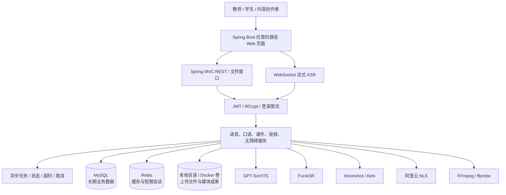
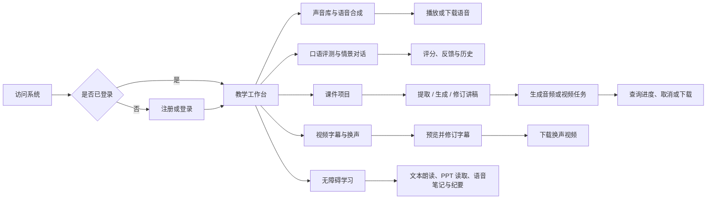

# 智韵教声

面向教师、学生和内容创作者的教学语音与数字课件处理系统。项目以 Java 业务服务为核心，将文本转语音、语音识别、声音复刻、口语训练、课件生成、视频换声和无障碍学习整合到统一 Web 工作台，并通过身份认证、资源归属校验、异步任务和文件安全机制管理完整处理过程。

## 项目亮点

- **教学语音能力集中化：** 提供普通与流式 TTS、文件与实时 ASR、方言合成、声音复刻、口语评测和多轮情景练习。
- **课件生产链路完整：** 支持读取 PPT/PPTX、生成和修订讲稿、生成课件音频与虚拟形象视频，并保留项目状态、版本和成果文件。
- **音视频处理可追踪：** 视频换声支持字幕预览与修订；课件优化、音频和视频等耗时操作通过异步任务暴露进度、结果、失败和取消状态。
- **安全边界明确：** 使用 JWT、BCrypt 和登录限流保护账号，通过用户上下文、资源归属、上传类型与路径校验隔离数据和文件。
- **渐进式运行：** 默认可使用 `nodb` 模式演示，也可接入 MySQL、Redis、GPT-SoVITS、FunASR、Moonshot/Kimi 和阿里云 NLS。
- **具备运维入口：** 仓库提供 Flyway、Actuator、Prometheus、Docker Compose、CI 与生产门禁脚本；生产结论仍须以目标环境实测为准。

## 一、总体架构



### 核心职责边界

| 组件 | 主要职责 | 边界说明 |
| --- | --- | --- |
| 静态 Web 页面 | 登录、录音、上传、播放、编辑、状态查询和结果展示 | 当前仓库仅包含已构建产物，不是可复现构建的前端源码工程 |
| Spring Boot 应用 | 鉴权、业务编排、用户隔离、任务状态、错误处理和外部调用 | 外部 AI 或语音服务不拥有本地业务状态 |
| MySQL | 用户、声音、练习历史、课件项目和任务等长期数据 | `nodb` 模式不依赖数据库 |
| Redis | 音色缓存和短期情景对话会话 | 未启用时使用进程内实现，不承担长期持久化 |
| 文件目录或持久卷 | 受控上传文件及音视频成果 | 访问须经过类型、归属和路径校验 |
| 外部 AI/语音服务 | 合成、识别、复刻和文本生成 | 未配置或不可用时，只影响依赖它的功能 |

## 二、完整业务链路



耗时流程遵循“提交任务—返回任务编号—查询状态—获取结果”。课件项目完成状态使用 `SUCCEEDED`，通用异步任务完成状态使用 `SUCCESS`，调用方不能混用。

## 三、核心模块

| 模块 | 主要能力 |
| --- | --- |
| 用户与认证 | 注册、登录、JWT 鉴权、BCrypt 密码散列、失败登录限流 |
| 声音库 | 公共与私有音色列表、搜索、上传、修改、删除和试听 |
| TTS 与方言 | 普通与流式 WAV、方言与流式 MP3 |
| ASR | 音频文件转写、WebSocket PCM 流式识别 |
| 声音复刻 | 本地 GPT-SoVITS 复刻、阿里云复刻与音色合成 |
| 口语练习 | 示例文本、语音评测、历史记录、多轮情景对话 |
| 课件项目 | PPT 摘要、讲稿生成与编辑、音频/头像/视频生成、成果下载 |
| 视频换声 | 字幕预览与修订、语音重建、视频合成 |
| 无障碍学习 | 文本朗读、PPT 读取、语音笔记和学习纪要 |
| 异步任务 | 去重、容量限制、进度、超时、取消和结果管理 |
| 运维监控 | Actuator 健康检查、Prometheus 指标、外部依赖就绪状态 |

当前源码共整理出 48 个唯一业务 REST 路由，另有 `/ws/asr/stream` WebSocket 和 `/actuator/health` 健康检查。请求参数、认证、响应示例和错误码见[接口文档](05-智韵教声-接口文档.md)。

## 四、设计思想

1. **服务端身份可信：** 受保护接口以 JWT 解析出的用户身份为准。
2. **业务编排与外部能力分离：** Spring Boot 管理用户、任务和文件，外部服务只提供受控能力。
3. **长期数据与短期状态分离：** MySQL 保存长期记录，Redis 只用于缓存与可丢弃会话。
4. **耗时操作状态化：** 媒体和 AI 任务提供进度、超时、取消与结果查询。
5. **文件访问最小化：** 上传经过扩展名、MIME、内容特征、大小和存储路径检查。
6. **失败必须可见：** 外部服务或媒体处理失败时返回可诊断错误，不用静态数据冒充成功。
7. **开发与生产证据分离：** 源码、Mock、Compose 配置和本机冒烟不能单独证明生产可用或容量上限。

## 五、技术栈

| 层次 | 技术 |
| --- | --- |
| 后端与接口 | Java 17、Spring Boot 3.4.1、Spring MVC、WebFlux、WebSocket、Bean Validation |
| AI 接入 | Spring AI 1.0.3、Moonshot/Kimi |
| 数据访问 | MyBatis、MySQL、Flyway |
| 缓存与会话 | Spring Data Redis、进程内降级实现 |
| 认证与安全 | Auth0 Java JWT、BCrypt、登录限流、上传安全校验 |
| 语音能力 | GPT-SoVITS、FunASR、阿里云 NLS |
| 文档与媒体 | Apache POI、FFmpeg、ffprobe |
| 可观测性 | Spring Boot Actuator、Micrometer、Prometheus |
| 构建与部署 | Maven、Docker、Docker Compose、GitHub Actions |
| 前端交付 | Spring Boot 托管的已构建 JavaScript/CSS 静态产物 |

## 六、项目结构

```text
.
├─ src/main/java/com/a09/tts/       # Controller、Service、Mapper、Repository、安全与配置
├─ src/main/resources/
│  ├─ static/                       # 已构建的前端静态产物
│  └─ db/migration/                 # Flyway 数据库迁移
├─ scripts/                         # FunASR、验证、负载冒烟和运维脚本
├─ ops/                             # 生产门禁、备份恢复与故障演练工具
├─ deploy/                          # 部署配置
├─ config/                          # 本地配置示例
├─ docs/                            # 运行、测试和验证资料
├─ docker-compose.yml               # MySQL、Redis、后端及可选监控
├─ Dockerfile                       # 后端镜像
├─ launch.ps1                       # Windows 启动入口
├─ RUN.md                           # 完整运行指南
└─ pom.xml                          # Maven 配置
```

## 七、快速启动

### 7.1 环境要求

JDK 17、Maven 3.9+；Compose 模式还需要 Docker Engine 与 Docker Compose v2。只有运行仓库内 FunASR 服务时才需要 Python 3.12 和本地模型。

### 7.2 推荐：免数据库演示模式

```powershell
./launch.ps1 -Mode nodb
```

启动后访问 <http://localhost:8081>。演示账号：

- `admin / admin123`
- `demo / demo123`

`nodb` 模式的数据保存在内存中，进程重启后不保证保留，仅适合本地演示和基础验证。

### 7.3 数据库模式

```powershell
Copy-Item config/application-local.yml.example config/application-local.yml
./launch.ps1 -Mode db
```

填写 MySQL 与 JWT 配置，或提供 `DB_HOST`、`DB_PORT`、`DB_NAME`、`DB_USERNAME`、`DB_PASSWORD`、`JWT_SECRET` 等环境变量。首次连接全新空库时，Flyway 会自动迁移；数据库模式不创建默认用户，首次使用需注册。

### 7.4 Docker Compose

```powershell
Copy-Item .env.example .env
docker compose config
docker compose up --build -d
docker compose ps
```

先将 `.env` 中的数据库、Redis 和 JWT 占位值替换为本地随机值。Compose 启动 MySQL、Redis 和后端；GPT-SoVITS 与 FunASR 默认仍是宿主机外部服务。

### 7.5 构建与测试

```powershell
mvn test
mvn -DskipTests package
```

MySQL、Redis、Python ASR、可观测性、负载冒烟和生产门禁的完整说明见[运行指南](RUN.md)。

## 八、外部能力配置

| 功能 | 默认地址或主要配置 | 未配置时的影响 |
| --- | --- | --- |
| GPT-SoVITS TTS / 本地复刻 | `http://127.0.0.1:9880/tts` | 对应合成或复刻不可用 |
| FunASR 文件识别 | `http://127.0.0.1:9977/asr` | 依赖识别的流程不可用 |
| Moonshot/Kimi | `moonshot.api.key` | 讲稿优化、摘要或纪要不可用 |
| 阿里云 NLS | `ALIYUN_NLS_APP_KEY`、`ALIYUN_AK_ID`、`ALIYUN_AK_SECRET` | 方言、云端复刻或相应流式识别不可用 |
| Redis | `REDIS_ENABLED` 及连接配置 | 音色不缓存，短期会话退回进程内保存 |

配置或接口存在只表示仓库具备接入能力，不代表相应外部服务当前已经可用。

## 九、项目文档

- [需求说明书](03-智韵教声-需求说明书.md)：项目范围、角色、功能与非功能需求、验收标准
- [概要设计文档](04-智韵教声-概要设计文档.md)：系统边界、分层、模块、数据、安全与部署设计
- [接口文档](05-智韵教声-接口文档.md)：REST、文件、音频流、WebSocket、认证、状态和错误约定
- [运行指南](RUN.md)：本地启动、数据库、Redis、Python ASR、Compose、CI 与生产门禁

## 十、前端源码状态

仓库没有 `package.json`、前端锁文件、Vite/Vue 配置或组件源码，只有 `src/main/resources/static` 下已经构建的 JavaScript/CSS bundle 和少量补丁脚本。因此：

- 当前静态页面可由 Spring Boot 直接提供；
- 无法从本仓库执行 `npm ci` 或得到可复现的前端构建；
- 不应反编译 bundle 或伪造前端源码工程；
- 正式发布前应找回原始前端仓库及锁文件，并在 CI 中加入真实前端构建。

## 十一、配置安全

真实数据库密码、Redis 密码、JWT Secret、Moonshot Key 和阿里云凭据只能通过环境变量或 Git 忽略的本地配置提供。仓库中的 `.env.example` 与配置示例只保留占位值，README、日志和提交记录不得写入真实凭据。

生产环境还应使用强随机密钥、HTTPS/WSS、受限 CORS、独立管理端口、最小化 Actuator 暴露和具有最小权限的上传目录。

## 十二、验证与生产边界

仓库提供自动化测试、打包、Compose healthcheck、Actuator、Prometheus、轻量负载冒烟、备份恢复与故障演练脚本，但：

- 单元测试或 Mock 通过，不等于真实外部服务联调通过；
- `docker compose config` 成功，不等于容器已启动并健康；
- 本机短时冒烟不是生产容量基准，不能外推 QPS 或 P95/P99；
- 历史 CI 不能证明当前未推送修改已经通过；
- 完整发布结论必须来自目标版本在目标 Linux、MySQL、Redis、媒体工具和真实外部服务上的实际门禁；
- 缺少可复现前端源码意味着不能证明完整产品已完成前端构建与发布验证。

本仓库具备运行、验证和逐步生产化的工程基础，但不宣称已经完成公网部署、真实容量认证或全部外部服务的当前可用性验证。
