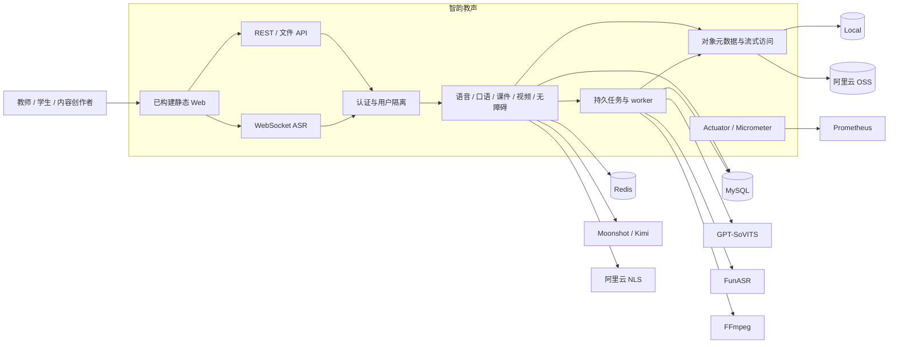
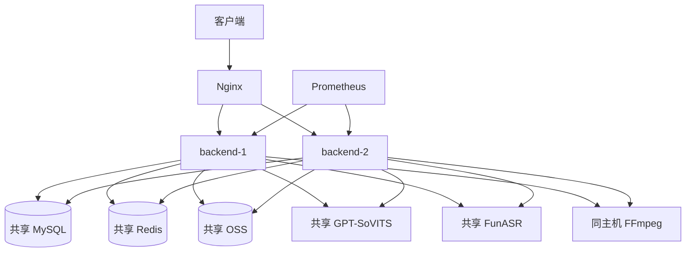
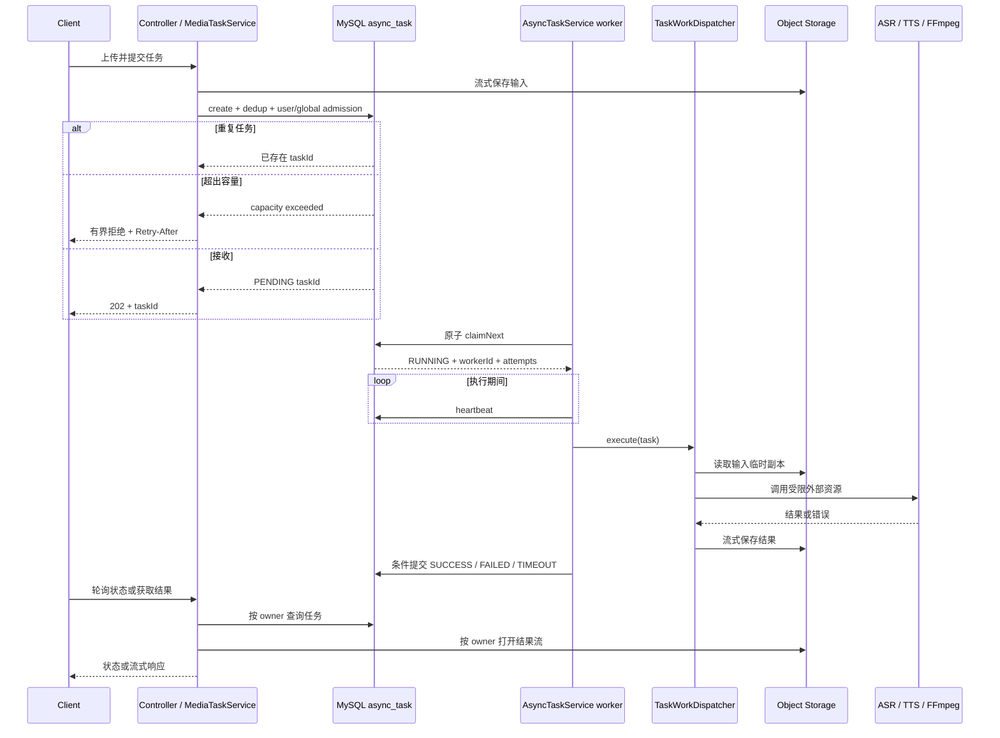
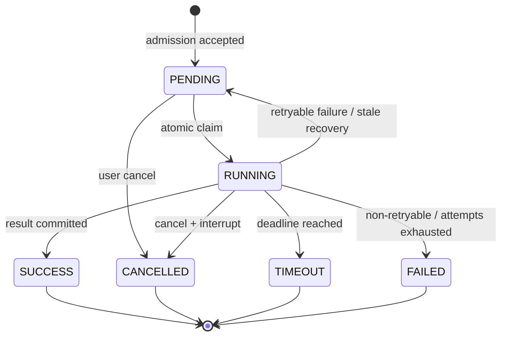
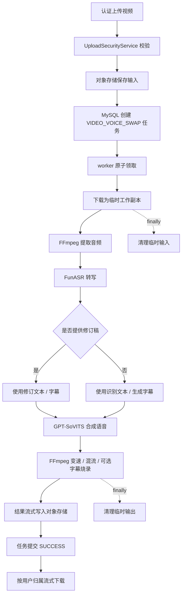
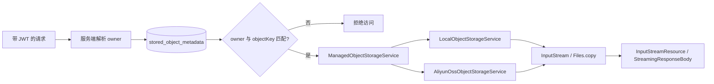
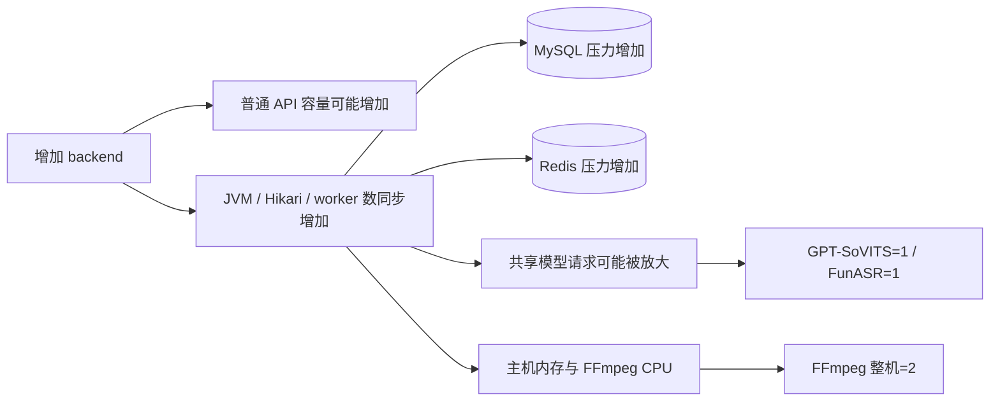

# 智韵教声最终项目架构说明

> 读者：Java 后端面试官、代码评审者和项目维护者。
>
> 架构状态：Phase 0–16 完成，最终评级 `READY_WITH_LIMITS`；本文只描述当前源码和已有验证，不提出新的核心业务架构改造。

## 1. 系统边界

智韵教声是一个模块化单体 Spring Boot 应用。Java 后端拥有用户、权限、业务项目、任务状态和文件元数据；GPT-SoVITS、FunASR、Moonshot/Kimi、阿里云 NLS 与 FFmpeg 是受控依赖，不拥有本地业务事实。



关键代码入口：

- 认证与登录：[`UserController`](../../src/main/java/com/a09/tts/controller/UserController.java)、[`UserServiceImpl`](../../src/main/java/com/a09/tts/service/impl/UserServiceImpl.java)、[`LoginRateLimiter`](../../src/main/java/com/a09/tts/security/LoginRateLimiter.java)
- 任务服务：[`AsyncTaskService`](../../src/main/java/com/a09/tts/task/AsyncTaskService.java)、[`JdbcTaskRepository`](../../src/main/java/com/a09/tts/task/JdbcTaskRepository.java)、[`TaskWorkDispatcher`](../../src/main/java/com/a09/tts/task/TaskWorkDispatcher.java)
- 存储：[`ManagedObjectStorageService`](../../src/main/java/com/a09/tts/storage/ManagedObjectStorageService.java)、[`AliyunOssObjectStorageService`](../../src/main/java/com/a09/tts/storage/AliyunOssObjectStorageService.java)
- 媒体编排：[`VideoVoiceSwapServiceImpl`](../../src/main/java/com/a09/tts/service/impl/VideoVoiceSwapServiceImpl.java)、[`CoursewareProjectService`](../../src/main/java/com/a09/tts/service/CoursewareProjectService.java)
- 资源隔离：[`TaskResourceBulkheads`](../../src/main/java/com/a09/tts/task/TaskResourceBulkheads.java)

## 2. 逻辑分层

| 层 | 职责 | 典型实现 |
| --- | --- | --- |
| 展示与接入 | 静态页面、REST、multipart、流式响应、WebSocket | `controller`、`src/main/resources/static` |
| 安全与协议 | JWT 用户上下文、登录限流、校验、统一错误、分页 | `security`、`config`、`api` |
| 业务编排 | 语音、口语、课件、视频、无障碍用例 | `service`、`service.impl` |
| 异步执行 | admission、任务状态、claim、heartbeat、retry、cleanup | `task`、`cleanup` |
| 数据与存储 | MyBatis/MySQL、Redis、对象元数据、Local/OSS | `mapper`、`task` repository、`storage` |
| 外部适配 | GPT-SoVITS、FunASR、Kimi、NLS、FFmpeg | HTTP client、SDK、外部进程执行器 |
| 可观测与交付 | health/readiness、指标、迁移、Compose、门禁 | Actuator、Micrometer、Flyway、`deploy`、`ops` |

这种分层仍然部署为一个 Java 应用，不应描述成微服务。它的价值是让领域编排、持久状态和外部能力边界清楚，同时保留单体的部署简单性。

## 3. 已验证双实例部署



已证明的部分：JWT 可跨节点使用；两个节点共享数据库、缓存和对象结果；Nginx 实际向两端分流；单 backend 下线后旧 JWT 请求继续成功；worker crash 后另一实例可回收任务。

尚未证明的部分：跨物理机、Linux/容器、云负载均衡、TLS、安全组、MySQL/Redis/Nginx HA、共享模型的跨实例全局 permit。尤其是单 JVM `Semaphore` 不能阻止两个 backend 同时各向同一个模型发送一个请求。

## 4. 持久异步任务架构

### 4.1 提交与执行时序



### 4.2 状态机



通用任务终态来自 [`TaskStatus`](../../src/main/java/com/a09/tts/task/TaskStatus.java)：`SUCCESS`、`FAILED`、`CANCELLED`、`TIMEOUT`。课件项目自身使用 `SUCCEEDED`，两套状态不能混用。

### 4.3 正确性机制

- `AsyncTaskService.submit` 将载荷序列化后交给 repository，在同一数据库边界内处理 active dedup、每用户 slot 和全局活动任务上限。
- `JdbcTaskRepository.claimNext` 通过单条条件 `UPDATE ... ORDER BY ... LIMIT 1` 把一条 `PENDING` 改为 `RUNNING`，写入 workerId 和 heartbeat，避免先查再处理的竞争窗口。
- 执行期间定时更新 heartbeat；超时通过带 owner token 的条件终态更新，避免旧 worker 覆盖新 owner。
- stale recovery 把未耗尽 attempts 的任务重新排队，把重试耗尽任务置为 `FAILED`，并释放用户 slot。
- 结果已生成但终态提交失败时清理未提交对象；终态任务继续清理上传临时对象。

数据库迁移证据见 [`V3__async_task.sql`](../../src/main/resources/db/migration/V3__async_task.sql)、[`V6__atomic_async_task_state.sql`](../../src/main/resources/db/migration/V6__atomic_async_task_state.sql)、[`V8__durable_task_worker_queue.sql`](../../src/main/resources/db/migration/V8__durable_task_worker_queue.sql) 和 [`V10__task_admission_backpressure.sql`](../../src/main/resources/db/migration/V10__task_admission_backpressure.sql)。

该设计保证“数据库中一条任务的领取和终态转换”具备原子条件，但不宣称外部模型调用、OSS 写入与 MySQL 提交之间达到分布式 exactly-once。

## 5. 核心视频换声流程



真实链路只验证了 small/medium 两条串行 happy path，因此整体仍为 `PARTIAL`。失败、large、编码矩阵、并发和长时媒体 soak 都不能从这两条样本外推。

## 6. 存储与用户归属模型



安全边界包括：

- 客户端不能通过请求参数任意指定可信 owner；owner 来自认证上下文。
- 对象 key 必须通过规范化与格式校验，元数据必须证明调用者拥有对象。
- 本地上传目录经过 `normalize`、`startsWith(root)` 和 real path 边界检查。
- 文件还会结合扩展名、MIME、magic、媒体解码和配额校验，服务端生成 UUID/对象 key。
- 永久对象与临时工作副本分离；多实例场景永久结果使用 OSS。

注意：对象元数据与对象本体不是一个原子事务，删除采用幂等与待清理队列补偿，而不是虚构跨 MySQL/OSS 分布式事务。

## 7. 高并发与可扩展性设计

### 7.1 请求层

- JWT 使普通 API 不依赖粘性会话，可在 Nginx 后横向增加 backend。
- Redis Lua 将 `INCR`、首次过期时间设置和 TTL 读取放在一次原子执行中，减少多实例限流竞争。
- 普通 API、登录、媒体上传和重任务采用不同测量口径，避免用总体指标掩盖 BCrypt 或外部模型延迟。
- 分页和容量敏感索引控制列表查询；是否进一步使用 cursor 或搜索服务，应由真实数据分布和 trace 触发。

### 7.2 任务层

- **持久化而非进程内队列：** worker 数增加时共享 MySQL 任务表，节点重启不会丢失已接受任务。
- **原子领取：** 多 worker 竞争同一条记录时只有一个 owner；claim 与终态更新都带条件。
- **背压：** `per-user-concurrency` 和 `global-queue-limit` 在任务创建时拒绝过载，而不是无限积压到 OOM。
- **公平资源舱壁：** TTS/ASR/FFmpeg/courseware 各有 permit，防止一种任务吞噬全部资源。
- **重试与恢复：** 指数退避受上限约束；heartbeat 和 stale recovery 处理 worker crash。

默认参数可在 [`application.yml`](../../src/main/resources/application.yml) 中核对：worker 2、每用户活动任务 2、全局活动任务 200、任务超时 15 分钟、heartbeat 10 秒、stale 45 秒。它们是保护参数，不是吞吐承诺。

### 7.3 I/O 与内存

- 对象上传和下载使用 `InputStream`，local adapter 通过 `Files.copy`，OSS adapter 返回 SDK 对象流。
- 任务结果下载使用 `InputStreamResource`；TTS/方言/声音复刻可使用 `StreamingResponseBody`。
- 视频和模型调用使用临时文件路径，完成后在 `finally` 删除，避免把完整视频保留在 heap。
- 受限堆测试证明 100/500 MiB 的媒体搬运路径不会随文件大小近似线性增长；它不是 500 MiB 转码证明。

### 7.4 扩容上限



因此扩容顺序应是：先保证共享模型的跨实例全局准入和基础设施容量，再增加 backend。当前没有实现跨实例模型 permit，不能把实例数与重任务容量做线性相乘。

## 8. 已验证容量边界

| 类别 | `VERIFIED` 或实测值 | 适用范围 | 未覆盖 |
| --- | --- | --- | --- |
| 注册数据基线 | 1,000 registered users | 测试数据规模 | 同时在线、同时登录或重任务并发 |
| mixed HTTP | 双实例 200 VU；3,711 requests；61.85 req/s；0 业务错误 | 本机、60 秒 steady、有 think time | 最大吞吐、互联网和云环境 |
| 普通 API 延迟 | 双实例 200 VU 最差 p95 50.50 ms | 该 mixed workload | 所有接口/数据分布和峰值突发 |
| 登录 | 7,083 steady 登录、0 错误；最高 p95 563.67 ms、p99 581.90 ms | 10/50/100/200 VU 周期负载，BCrypt cost 12 | 200 人同秒突发；高于约 6.55 login/s |
| GPT-SoVITS | safe concurrency 1 | 固定文本/参考音频、本机服务 | 长文本、音色分布、跨实例总并发 |
| FunASR | safe concurrency 1 | 固定 5.29 秒中文音频、本机服务 | 长音频、编码、噪声、准确率 |
| FFmpeg | machine-wide safe concurrency 2 | 固定 30 秒输入、已测 Windows 主机 | 其他编码/分辨率、云 CPU |
| OSS | 10/100/500 MiB 流式上传下载校验删除通过 | 本机经公网访问真实 OSS | safe concurrency、同地域内网和容灾 |
| 视频链路 | small/medium 串行 2/2 成功；15.755/23.246 秒 | 两个固定输入 happy path | large、并发、失败率分布 |
| soak | 100 VU、30 分钟、49,983 L0、6/6 TTS、0 业务错误 | 一次本机 mixed+少量 TTS | 60 分钟重复媒体 soak、WebSocket |

必须保持以下口径：

```text
1,000 registered users
!= 200 VU
!= 200 simultaneous logins
!= 200 simultaneous heavy jobs
```

数字、分母、资源指标与证据哈希见[最终容量报告](../scalability/FINAL_SCALABILITY_REPORT.md)。

## 9. 生产资格矩阵

| 项目 | 状态 | 核心理由 |
| --- | --- | --- |
| HTTP API | `VERIFIED` | 双实例 100/200 VU mixed HTTP 有直接证据 |
| login | `VERIFIED` | 保留 BCrypt cost 12，认证专用 SLO 通过 |
| MySQL | `PARTIAL` | 正确性和 restart 已测，HA/备份恢复/分区未测 |
| Redis | `PARTIAL` | 共享缓存/限流和 restart 已测，Sentinel/Cluster 未测 |
| JWT | `VERIFIED` | 跨节点 token 和节点切换已测 |
| multi-instance | `VERIFIED` | 同机双实例、共享状态、分流和节点恢复已测 |
| task claim | `VERIFIED` | 原子 claim、幂等和 worker crash recovery 已测 |
| file cleanup | `VERIFIED` | 原子 claim、stale、retry、幂等删除已测 |
| local storage | `PARTIAL` | 流式路径已测，但不是多实例永久存储 |
| object storage | `VERIFIED` | 真实 OSS 大小档、校验、删除和失败行为已测 |
| GPT-SoVITS | `VERIFIED` | 真实服务容量、故障和恢复已测，安全点为 1 |
| FunASR | `VERIFIED` | 真实服务 1/2/4 并发及故障恢复已测，安全点为 1 |
| FFmpeg | `VERIFIED` | 固定输入 1/2/4/8 测试，整机安全点为 2 |
| video pipeline | `PARTIAL` | 仅 small/medium 两条串行完整链路 |
| WebSocket | `PARTIAL` | 有限握手分流，未做连接和重连容量 |
| Nginx | `PARTIAL` | 分流和单 upstream 丢失已测，自身仍是单点 |
| failure recovery | `PARTIAL` | 六类单探针通过，未在 100/200 VU 负载中注入 |
| soak | `PARTIAL` | 一次 30 分钟 mixed+TTS，媒体覆盖不足且线程阶跃未归因 |
| cloud | `BLOCKED` | 未绑定目标云拓扑、规格、HA、安全和容量证据 |

合计：`VERIFIED=10`、`PARTIAL=8`、`BLOCKED=1`、`FAILED=0`。权威逐项定义见[生产就绪矩阵](../scalability/PRODUCTION_READINESS_MATRIX.md)。

## 10. 关键设计取舍

### 为什么用 MySQL 任务队列，而不是直接引入 MQ？

当前规模下，任务状态、幂等、用户容量 slot 和业务查询都已在 MySQL 中。用数据库条件更新可以用最少组件解决持久化、领取和恢复问题，也方便面试时解释事务边界。代价是高到达率下数据库会成为队列瓶颈；当前没有证据需要引入 Kafka/RabbitMQ，所以不做投机性架构升级。

### 为什么不降低 BCrypt cost？

profiling 显示 BCrypt 是登录耗时主因，但 cost 12 是明确的安全选择。项目为认证设置独立 SLO，而不是牺牲密码强度去满足普通 API 的 300 ms 阈值。

### 为什么永久产物使用 OSS、处理时仍用临时文件？

OSS 解决跨节点共享与持久化；FFmpeg 和部分模型天然更适合文件路径。worker 把对象流复制为受控临时文件，处理后流式写回并清理，兼顾工具兼容性和 heap 安全。

### 为什么不是微服务？

当前业务规模和团队上下文没有证明独立部署各模块的收益。模块化单体能减少网络、部署和分布式事务复杂度；外部模型和存储已经通过接口隔离，未来若有真实容量证据再拆分 worker。

## 11. 仍需明确说明的风险

1. 云环境仍为 `BLOCKED`，本机 Windows 证据不能外推 Linux、容器或公网 SLA。
2. MySQL、Redis、Nginx 和模型服务仍存在单点；restart 不等于 HA。
3. 两个 backend 共用模型时缺少跨实例全局 permit。
4. 200 VU 双实例测试最低可用内存约 370 MiB，当前宿主机不适合继续叠加重媒体并发。
5. 视频只有 small/medium 串行样本；真实 ASR/FFmpeg/video/OSS 未进入 30 分钟 soak。
6. WebSocket 未定标；已有连接不能在节点故障时迁移，只能客户端重连。
7. soak 中 live threads 出现 198→230→230 的有界阶跃，未继续增长但缺少 thread dump 定因。
8. 故障注入没有与 100/200 VU 同时运行，无法给恢复时间 p95/p99。
9. 曾暴露的 OSS 长期凭证必须轮换并改用最小权限 RAM/STS，未完成前不得用于生产。
10. 仓库已有 [`frontend`](../../frontend/) 下的 Vue 3/Vite 源码与 pnpm 锁文件，可复现历史 Vite 应用；但它尚不能复现当前 Spring Boot 托管的 legacy bundle 与 Phase 1–10 增强脚本，前端迁移对齐仍是完整产品构建缺口。

## 12. 证据索引

- 容量总报告：[FINAL_SCALABILITY_REPORT.md](../scalability/FINAL_SCALABILITY_REPORT.md)
- 资格矩阵：[PRODUCTION_READINESS_MATRIX.md](../scalability/PRODUCTION_READINESS_MATRIX.md)
- 登录 profiling：[PHASE16_LOGIN_PROFILE.md](../performance/PHASE16_LOGIN_PROFILE.md)
- 媒体流式化：[PHASE16_MEDIA_STREAMING.md](../performance/PHASE16_MEDIA_STREAMING.md)
- FunASR：[PHASE16_FUNASR.md](../performance/PHASE16_FUNASR.md)
- 视频全链路：[PHASE16_VIDEO_PIPELINE.md](../performance/PHASE16_VIDEO_PIPELINE.md)
- 真实 OSS：[PHASE16_OSS.md](../performance/PHASE16_OSS.md)
- 双实例：[PHASE16_MULTI_INSTANCE.md](../performance/PHASE16_MULTI_INSTANCE.md)
- 故障注入：[PHASE16_FAILURE_INJECTION.md](../performance/PHASE16_FAILURE_INJECTION.md)
- 30 分钟 soak：[PHASE16_SOAK.md](../performance/PHASE16_SOAK.md)

所有状态和数字以这些当前仓库文件为准；图表和文字是对证据的解释，不替代原始报告。
