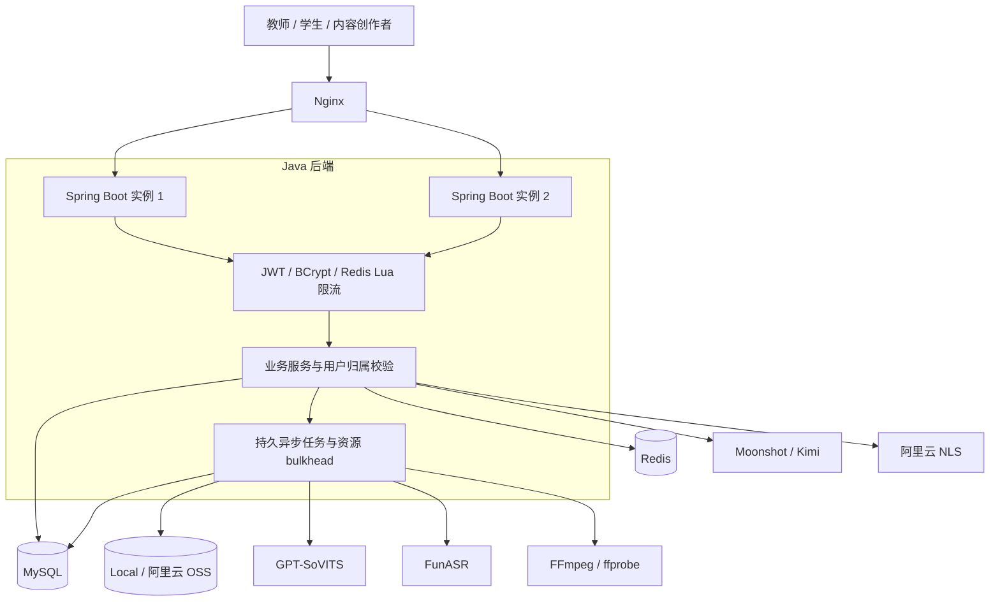
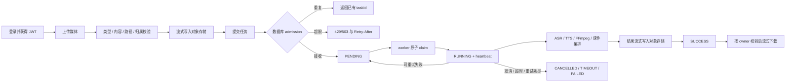

# 智韵教声：Java 后端求职展示版

> 项目定位：AI 语音业务场景下的 Java 后端工程化与高可靠异步任务系统。
>
> 当前结论：`READY_WITH_LIMITS`。该结论只覆盖 Phase 0–16 已记录的本机 Windows、双 Spring Boot 实例、共享 MySQL/Redis/OSS 和真实外部服务测试，不代表云生产容量承诺。

“智韵教声”面向教师、学生和内容创作者，提供语音合成、语音识别、声音复刻、口语练习、课件生成、视频换声和无障碍学习能力。求职展示的重点不是训练语音模型，而是 Java 后端如何安全地编排数据库、缓存、对象存储、外部模型和 FFmpeg，并让耗时任务可持久、可恢复、可限流、可观测。

## 一眼看懂项目

| 维度 | 当前实现 |
| --- | --- |
| 接入层 | Spring MVC REST、文件上传/下载、WebSocket 流式 ASR、Spring Boot 托管静态页面 |
| 身份与安全 | JWT、BCrypt cost 12、Redis Lua 登录限流、服务端用户上下文、上传与对象归属校验 |
| 核心业务 | TTS/ASR、声音库、声音复刻、口语练习、课件项目、视频换声、无障碍学习 |
| 异步任务 | MySQL 持久任务、幂等提交、原子领取、heartbeat、超时、重试、取消、stale recovery |
| 资源保护 | 全局/用户 admission、资源 bulkhead、有限 worker、超时和失败可见 |
| 数据与文件 | MyBatis + MySQL、Redis、Local/阿里云 OSS 存储抽象、流式媒体搬运 |
| 外部能力 | GPT-SoVITS、FunASR、Moonshot/Kimi、阿里云 NLS、FFmpeg/ffprobe |
| 运维验证 | Flyway、Actuator、Micrometer、Prometheus、Docker Compose、故障演练、k6 容量验证 |

## 架构概览



双实例是同一台已测 Windows 主机上的真实验证拓扑。MySQL 保存业务事实和任务状态，Redis 承担缓存与原子限流，OSS 为多实例提供共享永久对象；节点本地目录只适合临时工作副本或单节点演示。

## 核心业务流程



## 技术栈

| 类别 | 技术 |
| --- | --- |
| 语言与框架 | Java 17、Spring Boot 3.4.1、Spring MVC、WebFlux、WebSocket、Bean Validation |
| AI 接入 | Spring AI 1.0.3、Moonshot/Kimi |
| 数据层 | MyBatis、MySQL、Flyway |
| 缓存与限流 | Spring Data Redis、Redis Lua、进程内降级实现 |
| 认证安全 | Auth0 Java JWT、BCrypt、上传安全与对象归属校验 |
| 语音与媒体 | GPT-SoVITS、FunASR、阿里云 NLS、FFmpeg、ffprobe |
| 文档处理 | Apache POI |
| 存储 | 本地文件系统、阿里云 OSS SDK |
| 可观测性 | Actuator、Micrometer、Prometheus |
| 前端与页面交付 | Vue 3、Vite 5；Spring Boot 托管当前已构建静态页面 |
| 工程交付 | Maven、pnpm、Docker、Docker Compose、Nginx、GitHub Actions |

版本与依赖证据见 [`pom.xml`](../../pom.xml)，运行参数见 [`application.yml`](../../src/main/resources/application.yml)。

## Java 后端项目亮点

1. **把耗时媒体调用从 HTTP 生命周期中解耦。** 请求只负责校验、入库和返回 taskId；worker 从 MySQL 原子领取任务，维护状态、attempts、heartbeat 和终态，避免进程内 Future 丢失后无法恢复。
2. **用数据库保证多实例正确性。** 活跃任务幂等键、用户 slot、全局 admission lock、owner token 和条件更新共同约束重复提交、重复领取和容量超限。
3. **按稀缺资源做隔离。** TTS、ASR、FFmpeg 和课件处理分别经过公平 `Semaphore` bulkhead；资源获取超时会产生可观测拒绝，不让重任务无界拖垮 API。
4. **建立 local/OSS 统一存储边界。** 永久结果通过对象 key 和 owner 元数据访问，下载使用 `InputStreamResource`，临时副本在 `finally` 清理；真实 OSS 已完成 10/100/500 MiB 流式验证。
5. **把安全放在业务链路内。** 登录保留 BCrypt cost 12；Redis Lua 原子限流；上传同时检查扩展名、MIME、magic、解码、配额、规范化路径和资源归属。
6. **用分层 SLO 解释真实性能。** 普通 API 与 BCrypt 登录采用不同阈值；记录 p50/p95/p99、错误率、资源和外部服务安全并发，不用总 p95 掩盖慢接口。
7. **把恢复能力做成可验证行为。** Redis/MySQL/模型/节点故障有界返回，worker crash 后由另一实例 stale recovery；但不把单次 restart 测试包装成基础设施 HA。

## 高并发与可扩展性设计

这里的“高并发”指在明确负载模型和资源边界下保护正确性与稳定性，不是声称无限扩容。

- **无状态 API 横向扩展：** JWT 不绑定原节点；双实例共享 MySQL、Redis 和 OSS，Nginx 可分流普通 HTTP 请求。
- **持久队列：** MySQL 是任务事实源，原子 `UPDATE ... ORDER BY ... LIMIT 1` 完成 claim，worker crash 后基于 heartbeat 回收。
- **入口背压：** 创建任务时同时执行幂等、每用户并发和全局活动任务上限判断；超限立即拒绝并携带重试时间。
- **资源舱壁：** TTS、ASR、FFmpeg、课件任务分别限流，避免某一种重任务占满全部 worker。
- **流式 I/O：** 上传、对象存储读写和任务结果下载尽量使用 `InputStream`、`Files.copy` 或 `StreamingResponseBody`，避免媒体大小与 JVM heap 线性绑定。
- **缓存与限流：** Redis Lua 将计数与 TTL 设置放在一个原子脚本内；Redis 降级只提供单实例保护，不能冒充分布式高可用。
- **可观测反馈：** admission rejection、executor、登录分段、外部服务、JVM、Hikari 和业务任务指标用于找瓶颈和重新定标。

不能线性扩展的部分也必须说清：两个 backend 共享同一个 GPT-SoVITS/FunASR 时，单 JVM semaphore 不能形成跨实例全局配额；模型、主机内存、MySQL/Redis/Nginx 单点仍是上限。

## 已验证容量边界

| 能力 | 已验证结果 | 不能解释为 |
| --- | --- | --- |
| 双实例 mixed HTTP | 200 VU，60 秒 steady，3,711 requests，61.85 req/s，0 业务错误；普通 API 最差 p95 50.50 ms | 200 个重任务并发、互联网 SLA 或系统最大 RPS |
| 登录 | 10/50/100/200 VU；共 7,083 次 steady 登录，0 错误；最高 p95 563.67 ms、p99 581.90 ms | 200 人同秒登录；该 workload 在 200 VU 时约 6.55 login/s |
| GPT-SoVITS | 当前输入和本机环境的安全并发 1 | 多实例各放行 1，或长文本/所有音色同样成立 |
| FunASR | 固定 5.29 秒音频，本机安全并发 1 | 长音频、噪声、准确率或云 GPU 容量 |
| FFmpeg | 固定 30 秒输入，本机整机安全并发 2 | 任意编码、分辨率、长视频或每实例并发 2 |
| OSS | 10/100/500 MiB 串行上传、下载、SHA 和删除通过；4×10 MiB 并发 4/4 成功 | OSS safe concurrency、云内网吞吐或长期 SLA |
| 视频全链路 | 5.291 秒和 10 秒视频串行 2/2 `SUCCESS`，E2E 15.755/23.246 秒 | large、并发视频容量或统计失败率 |
| 30 分钟 soak | 100 VU，49,983 次 L0 请求，27.768 req/s，6/6 真实 TTS，0 业务错误 | 长期无泄漏、完整媒体 soak 或 60 分钟稳定性 |

完整定义、资源曲线和原始证据索引见[最终容量报告](../scalability/FINAL_SCALABILITY_REPORT.md)。

## 资格状态

| 状态 | 数量 | 项目 |
| --- | ---: | --- |
| `VERIFIED` | 10 | HTTP API、login、JWT、multi-instance、task claim、file cleanup、object storage、GPT-SoVITS、FunASR、FFmpeg |
| `PARTIAL` | 8 | MySQL、Redis、local storage、video pipeline、WebSocket、Nginx、failure recovery、soak |
| `BLOCKED` | 1 | cloud |
| `FAILED` | 0 | 无 |

`VERIFIED` 表示在指定提交、机器、输入和协议下有直接证据；`PARTIAL` 表示只覆盖了部分场景；`BLOCKED` 表示当前环境无法形成目标证据。逐项说明见[生产就绪矩阵](../scalability/PRODUCTION_READINESS_MATRIX.md)。

## 典型生产问题与解决方案

| 问题 | 解决方案 | 当前证据与边界 |
| --- | --- | --- |
| 进程内任务在重启后丢失 | MySQL 持久任务、原子 claim、heartbeat、retry、stale recovery | 双 worker 和 worker crash 已验证；外部副作用 exactly-once 未证明 |
| 多 worker 重复清理文件 | cleanup 表增加 `claimed_by/claimed_at`，按 owner 完成或释放 | 并发集成测试和双实例 live claim 通过；长期积压吞吐未测 |
| 大媒体进入 `byte[]` 导致 OOM 风险 | 对象存储与下载改为流式，FFmpeg 使用临时路径 | 100/500 MiB 在 `-Xmx96m` 搬运通过；不等于真实 500 MiB 转码 |
| BCrypt 登录看似未达普通 API SLO | 分段 Timer 定位 BCrypt 占主导，保留 cost 12，单独定义认证 SLO | 7,083 次 steady 登录通过；突发登录未测 |
| 多实例永久文件不可见 | local/OSS 抽象，永久产物写共享 OSS，owner 元数据校验 | 跨节点查询和下载通过；凭证治理、容灾仍未闭环 |
| 外部模型过载拖垮 API | bulkhead、超时、有界 worker、失败状态和 readiness | 单机安全点已定标；跨实例全局 permit 尚未实现 |
| 依赖或 worker 故障后任务卡死 | 有界失败、健康检查、stale recovery、attempts 和终态清理 | 六类单探针故障通过；负载中故障仍为 `PARTIAL` |

## 快速演示

环境要求：JDK 17、Maven 3.9+。本地展示可运行：

```powershell
./launch.ps1 -Mode nodb
```

访问 <http://localhost:8081>。`nodb` 只用于界面和基础业务演示；若要讲解持久任务、双实例、Redis 限流、OSS 或故障恢复，应展示已有源码和 Phase 16 报告，不能把 `nodb` 演示说成相应能力的实时证明。

数据库/Compose 启动、健康检查和外部服务配置见 [`RUN.md`](../../RUN.md)。5 分钟录制顺序见[演示脚本](DEMO_SCRIPT.md)。

## 面试材料导航

- [最终架构说明](ARCHITECTURE.md)：系统边界、部署、任务状态机、业务流程、容量和风险。
- [5 分钟演示脚本](DEMO_SCRIPT.md)：录屏准备、时间轴、台词和失败备用方案。
- [Java 后端面试讲解稿](INTERVIEW_GUIDE.md)：1 分钟自我介绍、5 分钟项目讲解、亮点、难点和生产问题。
- [30 个面试追问](INTERVIEW_QA.md)：标准回答、项目落点、证据和边界。
- [简历项目描述](RESUME_BULLETS.md)：7 条可核验表述及逐条证据映射。

## README 审计与修正说明

本文件是对根目录 [`README.md`](../../README.md) 的审计后求职展示稿，不修改核心代码，也没有覆盖原 README。主要修正如下：

1. 根 README 仍写“尚未完成真实容量认证”和“外部服务只具备配置能力”；Phase 16 已完成本机真实 GPT-SoVITS、FunASR、OSS、FFmpeg、视频链路和双实例验证，应改为“已完成受限验证，但云生产仍阻断”。
2. 原架构图仍以节点本地文件为主要永久存储，没有体现 MySQL durable task、数据库原子领取、共享 OSS、backpressure、resource bulkhead 和双实例恢复链路。
3. 原验证章节缺少 200 VU、认证专用 SLO、重任务安全点、30 分钟 soak、故障恢复时间和 `VERIFIED/PARTIAL/BLOCKED` 分级。
4. 原文没有形成适合面试的“问题—方案—证据—边界”叙事，本文件已补齐。
5. 原文关于“仓库没有 `package.json`、锁文件或前端源码”已经与当前 checkout 不一致：仓库现有 [`frontend`](../../frontend/) 下的 Vue 3/Vite 源码和 pnpm 锁文件。需要保留的真实限制是：该源码可复现历史 Vite 应用，但还不能复现当前 Spring Boot 正在托管的 legacy bundle 与 Phase 1–10 增强脚本，二者尚未完成迁移对齐。

## 明确不做的承诺

- 不声称“支持 1,000 并发”；1,000 只是注册账号数据基线。
- 不声称已经公网生产部署或通过目标云、Linux、容器、跨主机、HA 和灾备验证。
- 不声称微服务、MQ、Kubernetes、分布式锁或外部副作用 exactly-once。
- 不把 OSS 4 路功能成功写成安全并发上限，不把两条视频成功写成稳定失败率。
- 不把 AI 模型训练作为个人工作成果；项目负责的是 Java 后端编排、可靠性、安全和验证。

## 安全提醒

真实数据库密码、Redis 密码、JWT secret、模型 key 和 OSS AccessKey 不得进入仓库、README、日志或演示画面。曾经暴露的 OSS 长期凭证必须轮换；生产环境应改用限制到目标 bucket/prefix 的最小权限 RAM 身份或短期 STS，并通过 secret 注入。
